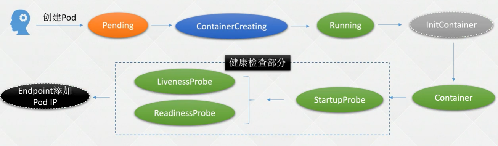

# 什么是POD

Pod 是 k8s 系统中可以创建和管理的最小单元，是资源对象模型中由用户创建或部署的最小资源对象模型，每个Pod中都可以包含一个或者多个容器，这些容器可以分为两类：

- 用户程序所在的容器，数量可多可少

- Pause容器，这是每个Pod都会有的一个**根容器**，它的作用有两个：

  - 可以以它为依据，评估整个Pod的健康状态
  - 可以在根容器上设置Ip地址，其它容器都此Ip（Pod IP），以实现Pod内部的网路通信

# 为什么要引入POD

```
1.强依赖的服务要部署在一起
2.多个服务需要协同工作,或者服务需要初始化一些东西
3.兼容其他CRI标准的Runtime
```


# POD生命周期


## POD 启动过程




## POD退出过程


# POD实战

## 创建POD

定义一个 Pod

vim nginx.yaml

```
apiVersion: v1 # 必选，API 的版本号
kind: Pod # 必选，类型 Pod
metadata: # 必选，元数据
 name: nginx # 必选，符合 RFC 1035 规范的 Pod 名称
spec: # 必选，用于定义 Pod 的详细信息
 containers: # 必选，容器列表
 - name: nginx # 必选，符合 RFC 1035 规范的容器名称
   image: nginx:1.15.12 # 必选，容器所用的镜像的地址
   ports: # 可选，容器需要暴露的端口号列表
   - containerPort: 80 # 端口号
```

创建 Pod：

```
# kubectl create -f nginx.yaml 
pod/nginx created
```

查看 Pod 状态：

```
# kubectl get po nginx
NAME READY STATUS RESTARTS AGE
nginx 0/1 ContainerCreating 0 20s
```

使用 kubectl run 创建一个 Pod：

```
# kubectl run nginx-run --image=nginx:1.15.12
```


## **更改 Pod 的启动命令和参数**

```
# vim nginx.yaml
apiVersion: v1 # 必选，API 的版本号
kind: Pod # 必选，类型 Pod
metadata: # 必选，元数据
name: nginx # 必选，符合 RFC 1035 规范的 Pod 名称
spec: # 必选，用于定义 Pod 的详细信息
 containers: # 必选，容器列表
 - name: nginx # 必选，符合 RFC 1035 规范的容器名称
   image: nginx:1.15.12 # 必选，容器所用的镜像的地址
   command: # 可选，容器启动执行的命令
   - sleep
   - "10"
   ports: # 可选，容器需要暴露的端口号列表
   - containerPort: 80 # 端口号
```

## **Pod** 状态及Pod故障排查命令


| 状态                          | 说明                                                         |
| ----------------------------- | ------------------------------------------------------------ |
| Pending（挂起）               | Pod 已被 Kubernetes 系统接收，但仍有一个或多个容器未被创建，可以通过kubectl describe 查看处于 Pending 状态的原因 |
| Running（运行中）             | Pod 已经被绑定到一个节点上，并且所有的容器都已经被创建，而且至少有一个是运行状态，或者是正在启动或者重启，可以通kubectl logs 查看 Pod 的日志 |
| Succeeded（成功）             | 所有容器执行成功并终止，并且不会再次重启，可以通过 kubectl logs 查看 Pod日志 |
| Failed（失败）                | 所有容器都已终止，并且至少有一个容器以失败的方式终止，也就是说这个容器要么以非零状态退出，要么被系统终止，可以通过 logs和 describe 查看 Pod 日志和状态 |
| Unknown（未知）               | 通常是由于通信问题造成的无法获得 Pod 的状态                  |
| ImagePullBackOff ErrImagePull | 镜像拉取失败，一般是由于镜像不存在、网络不通或者需要登录认证引起的，可以使用 describe 命令查看具体原因 |
| CrashLoopBackOff              | 容器启动失败，可以通过 logs 命令查看具体原因，一般为启动命令不正确，健康检查不通过等 |
| OOMKilled                     | 容器内存溢出，一般是容器的内存 Limit 设置的过小，或者程序本身有内存溢出，可以通过 logs 查看程序启动日志 |
| Terminating                   | Pod 正在被删除，可以通过 describe 查看状态                   |
| SysctlForbidden               | Pod 自定义了内核配置，但 kubelet 没有添加内核配置或配置的内核参数不支持，可以通过 describe 查看具体原因 |
| Completed                     | 容器内部主进程退出，一般计划任务执行结束会显示该状态，此时可以通过 logs查看容器日志 |
| ContainerCreating             | Pod 正在创建，一般为正在下载镜像，或者有配置不当的地方，可以通过 describe查看具体原因 |
|                               |                                                              |


|                             注意                             |
| :----------------------------------------------------------: |
| Pod 的 Phase 字段只有 Pending、Running、Succeeded、Failed、Unknown，其余的为处其余的为处于上述状态的原因，可以通过 kubectl get po xxx –o yaml 查看。 |


## **Pod** 镜像拉取策略

通过 spec.containers[].imagePullPolicy 参数可以指定镜像的拉取策略，目前支持的策略如下：

| 操作方式     | 说明                                                         |
| ------------ | ------------------------------------------------------------ |
| Always       | 总是拉取，当镜像 tag 为 latest 时，且 imagePullPolicy 未配置，默认为 Always |
| Never        | 不管是否存在都不会拉取                                       |
| IfNotPresent | 镜像不存在时拉取镜像，如果 tag 为非 latest，且 imagePullPolicy 未配置，默认为 IfNotPresent |

更改镜像拉取策略为 IfNotPresent：

```
# vim nginx.yaml
apiVersion: v1 # 必选，API 的版本号
kind: Pod # 必选，类型 Pod
metadata: # 必选，元数据
 name: nginx # 必选，符合 RFC 1035 规范的 Pod 名称
spec: # 必选，用于定义 Pod 的详细信息
 containers: # 必选，容器列表
 - name: nginx # 必选，符合 RFC 1035 规范的容器名称
   image: nginx:1.15.12 # 必选，容器所用的镜像的地址
   imagePullPolicy: IfNotPresent # 可选，镜像拉取策略
   ports: # 可选，容器需要暴露的端口号列表
   - containerPort: 80 # 端口号
```

##  Pod 重启策略

 可以使用 spec.restartPolicy 指定容器的重启策略

| 操作方式  | 说明                                      |
| --------- | ----------------------------------------- |
| Always    | 默认策略。容器失效时，自动重启该容器      |
| OnFailure | 容器以不为 0 的状态码终止，自动重启该容器 |
| Never     | 无论何种状态，都不会重启                  |

指定重启策略为 Never：

```
apiVersion: v1 # 必选，API 的版本号
kind: Pod # 必选，类型 Pod
metadata: # 必选，元数据
 name: nginx # 必选，符合 RFC 1035 规范的 Pod 名称
spec: # 必选，用于定义 Pod 的详细信息
 containers: # 必选，容器列表
 - name: nginx # 必选，符合 RFC 1035 规范的容器名称
   image: nginx:1.15.12 # 必选，容器所用的镜像的地址
   imagePullPolicy: IfNotPresent
   command: # 可选，容器启动执行的命令
   - sleep
   - "10"
   ports: # 可选，容器需要暴露的端口号列表
   - containerPort: 80 # 端口号
   restartPolicy: Never
```

## Pod 的三种探针

| 种类           | 说明                                                         |
| -------------- | ------------------------------------------------------------ |
| startupProbe   | Kubernetes1.16 新加的探测方式，用于判断容器内的应用程序是否已经启动。如果配置了 startupProbe，就会先禁用其他探测，直到它成功为止。如果探测失败，Kubelet会杀死容器，之后根据重启策略进行处理，如果探测成功，或没有配置 startupProbe，则状态为成功，之后就不再探测。 |
| livenessProbe  | 用于探测容器是否在运行，如果探测失败，kubelet 会“杀死”容器并根据重启策略进行相应的处理。如果未指定该探针，将默认为 Success |
| readinessProbe | 一般用于探测容器内的程序是否健康，即判断容器是否为就绪（Ready）状态。如果是，则可以处理请求，反之 Endpoints Controller 将从所有的 Service 的 Endpoints中删除此容器所在 Pod 的 IP 地址。如果未指定，将默认为 Success |


## Pod探针的实现方式

| 实现方式        | 说明                                                         |
| --------------- | ------------------------------------------------------------ |
| ExecAction      | 在容器内执行一个指定的命令，如果命令返回值为 0，则认为容器健康 |
| TCPSocketAction | 通过 TCP 连接检查容器指定的端口，如果端口开放，则认为容器健康 |
| HTTPGetAction   | 对指定的 URL 进行 Get 请求，如果状态码在 200~400 之间，则认为容器健康 |


##  livenessProbe 和readinessProbe


创建一个没有探针的 Pod：

```
apiVersion: v1 # 必选，API 的版本号
kind: Pod # 必选，类型 Pod
metadata: # 必选，元数据
 name: nginx # 必选，符合 RFC 1035 规范的 Pod 名称
spec: # 必选，用于定义 Pod 的详细信息
 containers: # 必选，容器列表
 - name: nginx # 必选，符合 RFC 1035 规范的容器名称
   image: nginx:1.15.12 # 必选，容器所用的镜像的地址
   imagePullPolicy: IfNotPresent
   command: # 可选，容器启动执行的命令
   - sh
   - -c
   - sleep 10; nginx -g "daemon off;"
   ports: # 可选，容器需要暴露的端口号列表
   - containerPort: 80 # 端口号
   restartPolicy: Never
```


配置健康检查：

```
apiVersion: v1 # 必选，API 的版本号
kind: Pod # 必选，类型 Pod
metadata: # 必选，元数据
 name: nginx # 必选，符合 RFC 1035 规范的 Pod 名称
spec: # 必选，用于定义 Pod 的详细信息
 containers: # 必选，容器列表
 - name: nginx # 必选，符合 RFC 1035 规范的容器名称
   image: nginx:1.15.12 # 必选，容器所用的镜像的地址
   imagePullPolicy: IfNotPresent
   command: # 可选，容器启动执行的命令
   - sh
   - -c
   - sleep 10; nginx -g "daemon off;"
   readinessProbe: # 可选，健康检查。注意三种检查方式同时只能使用一种。
     httpGet: # 接口检测方式
       path: /index.html # 检查路径
       port: 80
       scheme: HTTP # HTTP or HTTPS
       #httpHeaders: # 可选, 检查的请求头
       #- name: end-user
       # value: Jason 
     initialDelaySeconds: 10 # 初始化时间, 健康检查延迟执行时间
     timeoutSeconds: 2 # 超时时间
     periodSeconds: 5 # 检测间隔
     successThreshold: 1 # 检查成功为 2 次表示就绪
     failureThreshold: 2 # 检测失败 1 次表示未就绪
   livenessProbe: # 可选，健康检查
     tcpSocket: # 端口检测方式
       port: 80
     initialDelaySeconds: 10 # 初始化时间
     timeoutSeconds: 2 # 超时时间
     periodSeconds: 5 # 检测间隔
     successThreshold: 1 # 检查成功为 2 次表示就绪
     failureThreshold: 2 # 检测失败 1 次表示未就绪
   ports: # 可选，容器需要暴露的端口号列表
   - containerPort: 80 # 端口号
   restartPolicy: Never
```

##  配置StartupProbe

```
apiVersion: v1 # 必选，API 的版本号
kind: Pod # 必选，类型 Pod
metadata: # 必选，元数据
 name: nginx # 必选，符合 RFC 1035 规范的 Pod 名称
spec: # 必选，用于定义 Pod 的详细信息
 containers: # 必选，容器列表
 - name: nginx # 必选，符合 RFC 1035 规范的容器名称
   image: nginx:1.15.12 # 必选，容器所用的镜像的地址
   imagePullPolicy: IfNotPresent
   command: # 可选，容器启动执行的命令
   - sh
   - -c
   - sleep 30; nginx -g "daemon off;"
   startupProbe:
     tcpSocket: # 端口检测方式
       port: 80
     initialDelaySeconds: 10 # 初始化时间
     timeoutSeconds: 2 # 超时时间
     periodSeconds: 5 # 检测间隔
     successThreshold: 1 # 检查成功为 2 次表示就绪
     failureThreshold: 5 # 检测失败 1 次表示未就绪
   readinessProbe: # 可选，健康检查。注意三种检查方式同时只能使用一种。
     httpGet: # 接口检测方式
       path: /index.html # 检查路径
       port: 80
       scheme: HTTP # HTTP or HTTPS
       #httpHeaders: # 可选, 检查的请求头
       #- name: end-user
       # value: Jason 
       initialDelaySeconds: 10 # 初始化时间, 健康检查延迟执行时间
       timeoutSeconds: 2 # 超时时间
       periodSeconds: 5 # 检测间隔
       successThreshold: 1 # 检查成功为 2 次表示就绪
       failureThreshold: 2 # 检测失败 1 次表示未就绪
   livenessProbe: # 可选，健康检查
     exec: # 端口检测方式
       command:
       - sh
       - -c
       - pgrep nginx
     initialDelaySeconds: 10 # 初始化时间
     timeoutSeconds: 2 # 超时时间
     periodSeconds: 5 # 检测间隔
     successThreshold: 1 # 检查成功为 2 次表示就绪
     failureThreshold: 2 # 检测失败 1 次表示未就绪
   ports: # 可选，容器需要暴露的端口号列表
   - containerPort: 80 # 端口号
   restartPolicy: Never
```


## preStop 和 postStart


```
apiVersion: v1 # 必选，API 的版本号
kind: Pod # 必选，类型 Pod
metadata: # 必选，元数据
 name: nginx # 必选，符合 RFC 1035 规范的 Pod 名称
spec: # 必选，用于定义 Pod 的详细信息
 containers: # 必选，容器列表
 - name: nginx # 必选，符合 RFC 1035 规范的容器名称
   image: nginx:1.15.12 # 必选，容器所用的镜像的地址
   imagePullPolicy: IfNotPresent
   lifecycle:
     postStart: # 容器创建完成后执行的指令, 可以是 exec httpGet TCPSocket
       exec:
         command:
         - sh
         - -c
         - 'mkdir /data/'
     preStop:
       exec:
         command:
         - sh
         - -c
         - sleep 10
   ports: # 可选，容器需要暴露的端口号列表
   - containerPort: 80 # 端口号
   restartPolicy: Never
```


## gRPC探测(1.24默认开启)

 

```
apiVersion: v1
kind: Pod
metadata:
 name: etcd-with-grpc
spec:
 containers:
 - name: etcd
   image: registry.cn-hangzhou.aliyuncs.com/google_containers/etcd:3.5.1-0
   command: [ "/usr/local/bin/etcd", "--data-dir", "/var/lib/etcd", "--listen-client-urls", "http://0.0.0.0:2379", "--advertise-client-urls", "http://127.0.0.1:2379", "--log-level", "debug"]
   ports:
   - containerPort: 2379
   livenessProbe:
     grpc:
       port: 2379
     initialDelaySeconds: 10
```


