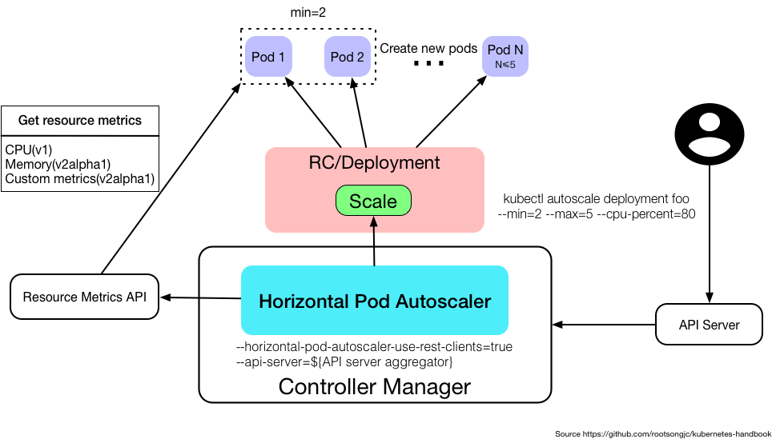

## Replication Controller 和 ReplicaSet

Replication Controller（复制控制器，RC）和 ReplicaSet（复制集，RS）是两种简单部署 Pod

的方式。因为在生产环境中，主要使用更高级的 Deployment 等方式进行 Pod 的管理和部署，所

以只需要简单了解即可。

### Replication Controller

Replication Controller（简称 RC）可确保 Pod 副本数达到期望值，也就是 RC 定义的数量。

换句话说，Replication Controller 可确保一个 Pod 或一组同类 Pod 总是可用。如果存在的 Pod 大于设定的值，则 Replication Controller 将终止额外的 Pod。如果太小，Replication Controller 将启动更多的 Pod 用于保证达到期望值。与手动创建 Pod 不同的是，用Replication Controller 维护的 Pod 在失败、删除或终止时会自动替换。因此即使应用程序只需要一个 Pod，也应该使用 Replication Controller 或其他方式管理。Replication Controller 类似于进程管理程序，但是 Replication Controller 不是监视单个节点上的各个进程，而是监视多个节点上的多个 Pod。

定义一个 Replication Controller 的示例如下。

```
apiVersion: v1
kind: ReplicationController
metadata:
 name: nginx
spec:
 replicas: 3
 selector:
   app: nginx
 template:
   metadata:
     name: nginx
     labels:
       app: nginx
   spec:
     containers:
     - name: nginx
       image: nginx
       ports:
       - containerPort: 80
```

### ReplicaSet

ReplicaSet 是支持基于集合的标签选择器的下一代 Replication Controller，它主要用作Deployment 协调创建、删除和更新 Pod，和 Replication Controller 唯一的区别是，ReplicaSet 支持标签选择器。在实际应用中，虽然 ReplicaSet 可以单独使用，但是一般建议使用 Deployment 来自动管理 ReplicaSet，除非自定义的 Pod 不需要更新或有其他编排等。

定义一个 ReplicaSet 的示例如下：

```
apiVersion: apps/v1
kind: ReplicaSet
metadata:
  name: frontend
  labels:
    app: guestbook
    tier: frontend   
spec:
  # modify replicas according to your case
  replicas: 3
  selector:
    matchLabels:
      tier: frontend
    matchExpressions:
      - {key: tier, operator: In, values: [frontend]}
  template:
    metadata:
      labels:
        app: guestbook
        tier: frontend
    spec:
      containers:
      - name: php-redis
        image: gcr.io/google_samples/gb-frontend:v3
        resources:
          requests:
            cpu: 100m
            memory: 100Mi
        env:
        - name: GET_HOSTS_FROM
          value: dns
          # If your cluster config does not include a dns service, then to
          # instead access environment variables to find service host
          # info, comment out the 'value: dns' line above, and uncomment the
          # line below.
          # value: env
        ports:
        - containerPort: 80
```

Replication Controller 和 ReplicaSet 的创建删除和 Pod 并无太大区别，Replication Controller目前几乎已经不在生产环境中使用，ReplicaSet 也很少单独被使用，都是使用更高级的资源Deployment、DaemonSet、StatefulSet 进行管理 Pod。


## Deployment无状态应用管理

无状态应用管理 Deployment

### 创建 Deployment

**从 Kubernetes 1.16 版本开始，彻底废弃了其他的 APIVersion，只能使用 apps/v1，1.16 以下的版本可以使用 extension 等。**

创建一个 Deployment：

```
apiVersion: apps/v1
kind: Deployment
metadata:
  name: nginx-deployment
  labels:
    app: nginx
spec:
  replicas: 3
  selector:
    matchLabels:
      app: nginx
  template:
    metadata:
      labels:
        app: nginx
    spec:
      containers:
      - name: nginx
        image: nginx:1.15.12
        ports:
        - containerPort: 80
```

示例解析：

1. nginx-deployment：Deployment的名称；

2. replicas： 创建Pod的副本数；

3. selector：定义Deployment如何找到要管理的Pod，与template的label（标签）对应，apiVersion为apps/v1必须指定该字段；

4. template字段包含以下字段： 

​        app: nginx使用label（标签）标记Pod； 

​        spec：表示Pod运行一个名字为nginx的容器；

​        image：运行此Pod使用的镜像；

​        Port：容器用于发送和接收流量的端口。


使用 kubectl create 创建此 Deployment：

```
# kubectl create -f dp-nginx.yaml 
deployment.apps/nginx-deployment created
```

使用 kubectl get 或者 kubectl describe 查看此 Deployment 的状态：

```
# kubectl get deploy
NAME             READY UP-TO-DATE AVAILABLE AGE
nginx-deployment 0/3   3          0         8s
```

➢ NAME：集群中Deployment的名称；

➢ READY：Pod就绪个数和总副本数； 

➢ UP-TO-DATE：显示已达到期望状态的被更新的副本数；

➢ AVAILABLE：显示用户可以使用的应用程序副本数，当前为0，说明目前还没有达到期望的Pod；

➢ AGE：显示应用程序运行的时间。

可以使用 rollout 命令查看整个 Deployment 创建的状态：

```
# kubectl rollout status deployment/nginx-deployment
deployment "nginx-deployment" successfully rolled out
```

当 rollout 结束时，再次查看此 Deployment，可以看到 AVAILABLE 的数量和 yaml 文件中

定义的 replicas 相同：

```
# kubectl get deploy
NAME             READY UP-TO-DATE AVAILABLE AGE
nginx-deployment 3/3   3          3         10m
```

查看此 Deployment 当前对应的 ReplicaSet：

```
# kubectl get rs -l app=nginx
NAME                        DESIRED CURRENT READY AGE
nginx-deployment-5c689d88bb 3       3       3     12m
```

➢ DESIRED：应用程序副本数； 

➢ CURRENT：当前正在运行的副本数； 

当 Deployment 有过更新，对应的 RS 可能不止一个，可以通过-o yaml 获取当前对应的 RS是哪个，其余的 RS 为保留的历史版本，用于回滚等操作。

查看此 Deployment 创建的 Pod，可以看到 Pod 的 hash 值 5c689d88bb 和上述 Deployment 对应的 ReplicaSet 的 hash 值一致：

```
# kubectl get pods --show-labels
NAME                              READY   STATUS   RESTARTS  AGE  LABELS
nginx-deployment-5c689d88bb-6b95k 1/1     Running  0         13m  app=nginx,pod-template-hash=5c689d88bb
nginx-deployment-5c689d88bb-9z5z2 1/1     Running  0         13m  app=nginx,pod-template-hash=5c689d88bb
nginx-deployment-5c689d88bb-jc8hr 1/1     Running  0         13m  app=nginx,pod-template-hash=5c689d88bb
```

### 更新 Deployment

**当且仅当 Deployment 的 Pod 模板（即.spec.template）更改时，才会触发 Deployment更新，例如更改内存、CPU 配置或者容器的 image。**

假如更新 Nginx Pod 的 image 使用 nginx:latest，并使用--record 记录当前更改的参数，后期回滚时可以查看到对应的信息：

```
# kubectl set image deployment nginx-deployment nginx=nginx:1.9.1 --record
deployment.extensions/nginx-deployment image updated
```

当然也可以使用 edit 命令直接编辑 Deployment，效果相同

```
# kubectl edit deployment.v1.apps/nginx-deployment
deployment.apps/nginx-deployment edited
```

同样可以使用 kubectl rollout status 查看更新过程：

```
# kubectl rollout status deployment.v1.apps/nginx-deployment
Waiting for deployment "nginx-deployment" rollout to finish: 1 out of 3 
new replicas have been updated...
Waiting for deployment "nginx-deployment" rollout to finish: 2 out of 3 
new replicas have been updated...
Waiting for deployment "nginx-deployment" rollout to finish: 2 out of 3 
new replicas have been updated...
Waiting for deployment "nginx-deployment" rollout to finish: 2 out of 3 
new replicas have been updated...
Waiting for deployment "nginx-deployment" rollout to finish: 1 old 
replicas are pending termination...
Waiting for deployment "nginx-deployment" rollout to finish: 1 old 
replicas are pending termination...
deployment "nginx-deployment" successfully rolled out
```

可以看出更新过程为新旧交替更新，首先新建一个 Pod，当 Pod 状态为 Running 时，删除一个旧的 Pod，同时再创建一个新的 Pod。当触发一个更新后，会有新的 ReplicaSet 产生，旧的ReplicaSet 会被保存，查看此时 ReplicaSet，可以从 AGE 或 READY 看出来新旧 ReplicaSet：

```
# kubectl get rs 
NAME                        DESIRED CURRENT READY AGE
nginx-deployment-5c689d88bb 0       0       0     34m
nginx-deployment-6987cdb55b 3       3       3     5m14s
```

通过 describe 查看 Deployment 的详细信息：

```
# kubectl describe deploy nginx-deployment
Name: nginx-deployment
Namespace: default
...
OldReplicaSets: <none>
NewReplicaSet: nginx-deployment-6987cdb55b (3/3 replicas created)
Events:
 Type Reason Age From Message
 ---- ------ ---- ---- -------
 Normal ScalingReplicaSet 36m deployment-controller Scaled up 
replica set nginx-deployment-5c689d88bb to 3
 Normal ScalingReplicaSet 7m16s deployment-controller Scaled up 
replica set nginx-deployment-6987cdb55b to 1
 Normal ScalingReplicaSet 5m18s deployment-controller Scaled down 
replica set nginx-deployment-5c689d88bb to 2
 Normal ScalingReplicaSet 5m18s deployment-controller Scaled up 
replica set nginx-deployment-6987cdb55b to 2
 Normal ScalingReplicaSet 4m35s deployment-controller Scaled down 
replica set nginx-deployment-5c689d88bb to 1
 Normal ScalingReplicaSet 4m34s deployment-controller Scaled up 
replica set nginx-deployment-6987cdb55b to 3
 Normal ScalingReplicaSet 3m30s deployment-controller Scaled down 
replica set nginx-deployment-5c689d88bb to 0
```

在 describe 中可以看出，第一次创建时，它创建了一个名为 nginx-deployment-5c689d88bb 的ReplicaSet，并直接将其扩展为 3 个副本。更新部署时，它创建了一个新的 ReplicaSet，命名为nginx-deployment-6987cdb55b，并将其副本数扩展为 1，然后将旧的 ReplicaSet 缩小为 2，这样至少可以有 2 个 Pod 可用，最多创建了 4 个 Pod。以此类推，使用相同的滚动更新策略向上和向下

扩展新旧 ReplicaSet，最终新的 ReplicaSet 可以拥有 3 个副本，并将旧的 ReplicaSet 缩小为 0。


### 回滚 Deployment

当更新了版本不稳定或配置不合理时，可以对其进行回滚操作，假设我们又进行了几次更新（此处以更新镜像版本触发更新，更改配置效果类似）：

```
# kubectl set image deployment nginx-deployment nginx=dotbalo/canary:v1 --record
# kubectl set image deployment nginx-deployment nginx=dotbalo/canary:v2 --record
```

使用 kubectl rollout history 查看更新历史：

```
# kubectl rollout history deployment/nginx-deployment
REVISION CHANGE-CAUSE
1 <none>
2 kubectl set image deployment nginx-deployment nginx=nginx:1.9.1 --record=true
3 kubectl set image deployment nginx-deployment nginx=dotbalo/canary:v1 --record=true
4 kubectl set image deployment nginx-deployment nginx=dotbalo/canary:v2 --record=true
```

查看 Deployment 某次更新的详细信息，使用--revision 指定某次更新版本号：

```
# kubectl rollout history deployment/nginx-deployment --revision=3
deployment.apps/nginx-deployment with revision #3
Pod Template:
 Labels: app=nginxpod-template-hash=645959bf6b
 Annotations: kubernetes.io/change-cause: kubectl set image deployment 
nginx-deployment nginx=dotbalo/canary:v1 --record=true
 Containers:
   nginx:
     Image: dotbalo/canary:v1
     Port: 80/TCP
     Host Port: 0/TCP
     Environment:<none>
     Mounts: <none>
     Volumes: <none>
```

如果只需要回滚到上一个稳定版本，使用 kubectl rollout undo 即可：

```
# kubectl rollout undo deployment/nginx-deployment
deployment.apps/nginx-deployment
```

再次查看更新历史，发现 REVISION5 回到了 canary:v1：

```
# kubectl rollout history deployment/nginx-deployment
REVISION CHANGE-CAUSE
1 <none>
2 kubectl set image deployment nginx-deployment nginx=nginx:1.9.1 --record=true
4 kubectl set image deployment nginx-deployment nginx=dotbalo/canary:v2 --record=true
5 kubectl set image deployment nginx-deployment nginx=dotbalo/canary:v1 --record=true
```

如果要回滚到指定版本，使用--to-revision 参数：

```
# kubectl rollout undo deployment/nginx-deployment --to-revision=2
deployment.extensions/nginx-deployment
```

### 扩容 Deployment

当公司访问量变大，或者有预期内的活动时，三个 Pod 可能已无法支撑业务时，可以提前对其进行扩展。使用 kubectl scale 动态调整 Pod 的副本数，比如增加 Pod 为 5 个：

```
# kubectl scale deployment.v1.apps/nginx-deployment --replicas=5
deployment.apps/nginx-deployment scaled
```

查看 Pod，此时 Pod 已经变成了 5 个：

```
# kubectl get po
NAME                              READY STATUS RESTARTS AGE
nginx-deployment-5f89547d9c-5r56b 1/1   Running 0       90s
nginx-deployment-5f89547d9c-htmn7 1/1   Running 0       25s
nginx-deployment-5f89547d9c-nwxs2 1/1   Running 0       99s
nginx-deployment-5f89547d9c-rpwlg 1/1   Running 0       25s
nginx-deployment-5f89547d9c-vlr5p 1/1   Running 0       95s
```

### 暂停和恢复 Deployment 更新

上述演示的均为更改某一处的配置，更改后立即触发更新，大多数情况下可能需要针对一个资源文件更改多处地方，而并不需要多次触发更新，此时可以使用 Deployment 暂停功能，临时禁用更新操作，对 Deployment 进行多次修改后在进行更新。

使用 kubectl rollout pause 命令即可暂停 Deployment 更新：

```
# kubectl rollout pause deployment/nginx-deployment
deployment.extensions/nginx-deployment paused
```

然后对 Deployment 进行相关更新操作，比如先更新镜像，然后对其资源进行限制（如果使用的是 kubectl edit 命令，可以直接进行多次修改，无需暂停更新，kubectlset 命令一般会集成在CICD 流水线中）：

```
# kubectl set image deployment.v1.apps/nginx-deployment nginx=nginx:1.9.1
deployment.apps/nginx-deployment image updated
# kubectl set resources deployment.v1.apps/nginx-deployment -c=nginx --limits=cpu=200m,memory=512Mi
deployment.apps/nginx-deployment resource requirements updated
```

通过 rollout history 可以看到没有新的更新：

```
# kubectl rollout history deployment.v1.apps/nginx-deployment deployment.apps/nginx-deployment 
REVISION CHANGE-CAUSE
1 <none>
5 kubectl set image deployment nginx-deployment nginx=dotbalo/canary:v1 --record=true
7 kubectl set image deployment nginx-deployment nginx=dotbalo/canary:v2 --record=true
8 kubectl set image deployment nginx-deployment nginx=dotbalo/canary:v2 --record=true
```

进行完最后一处配置更改后，使用 kubectl rollout resume 恢复 Deployment 更新：

```
# kubectl rollout resume deployment.v1.apps/nginx-deployment
deployment.apps/nginx-deployment resumed
```

可以查看到恢复更新的 Deployment 创建了一个新的 RS（ReplicaSet 缩写）：

```
# kubectl get rs
NAME                        DESIRED CURRENT READY AGE
nginx-deployment-57895845b8 5       5       4     11s
```

可以查看 Deployment 的 image（镜像）已经变为 nginx:1.9.1

```
# kubectl describe deploy nginx-deployment
Name: nginx-deployment
Namespace: default
...
Annotations: deployment.kubernetes.io/revision: 9
             kubernetes.io/change-cause: kubectl set image 
             deployment nginx-deployment nginx=dotbalo/canary:v2 --record=true
Selector: app=nginx
Replicas: 5 desired | 5 updated | 5 total | 5 available | 0 unavailable
StrategyType: RollingUpdate
MinReadySeconds: 0
RollingUpdateStrategy: 25% max unavailable, 25% max surge
Pod Template:
 Labels: app=nginx
 Containers:
   nginx:
     Image: nginx:1.9.1
     Port: 80/TCP
     Host Port: 0/TCP
```

### 更新 Deployment 的注意事项

历史版本清理策略：

```
在默认情况下，revision 保留 10 个旧的 ReplicaSet，其余的将在后台进行垃圾回收，可以在.spec.revisionHistoryLimit 设置保留 ReplicaSet 的个数。当设置为 0 时，不保留历史记录。
```

更新策略：

```
5. .spec.strategy.type==Recreate，表示重建，先删掉旧的Pod再创建新的Pod；

6. .spec.strategy.type==RollingUpdate，表示滚动更新，可以指定maxUnavailable和maxSurge来控制滚动更新过程；

	 .spec.strategy.rollingUpdate.maxUnavailable，指定在回滚更新时最大不可用的Pod数量，可选字段，默认为25%，可以设置为		  数字或百分比，如果maxSurge为0，则该值不能为0； 

	 .spec.strategy.rollingUpdate.maxSurge可以超过期望值的最大Pod数，可选字段，默认为25%，可以设置成数字或百分比，如果maxUnavailable为0，则该值不能为0。

```

Ready 策略：

```
.spec.minReadySeconds 是可选参数，指定新创建的 Pod 应该在没有任何容器崩溃的情况下视为 Ready（就绪）状态的最小秒数，默认为 0，即一旦被创建就视为可用，通常和容器探针连用。
```

## StatefulSet有状态应用管理 

StatefulSet是为了解决有状态服务的问题（对应Deployments和ReplicaSets是为无状态服务而设计），其应用场景包括：

- 稳定的持久化存储，即Pod重新调度后还是能访问到相同的持久化数据，基于PVC来实现
- 稳定的网络标志，即Pod重新调度后其PodName和HostName不变，基于Headless Service（即没有Cluster IP的Service）来实现
- 有序部署，有序扩展，即Pod是有顺序的，在部署或者扩展的时候要依据定义的顺序依次依次进行（即从0到N-1，在下一个Pod运行之前所有之前的Pod必须都是Running和Ready状态），基于init containers来实现
- 有序收缩，有序删除（即从N-1到0）

从上面的应用场景可以发现，StatefulSet由以下几个部分组成：

- 用于定义网络标志（DNS domain）的Headless Service
- 用于创建PersistentVolumes的volumeClaimTemplates
- 定义具体应用的StatefulSet

### 定义StatefulSet 

定义一个简单的 StatefulSet 的示例如下：

```
apiVersion: v1
kind: Service
metadata:
  name: nginx
  labels:
    app: nginx
spec:
  ports:
  - port: 80
    name: web
  clusterIP: None
  selector:
    app: nginx
---
apiVersion: apps/v1
kind: StatefulSet
metadata:
  name: web
spec:
  serviceName: "nginx"
  replicas: 2
  selector:
    matchLabels:
      app: nginx
  template:
    metadata:
      labels:
        app: nginx
    spec:
      containers:
      - name: nginx
        image: nginx
        ports:
        - containerPort: 80
          name: web
```

其中： 

➢ kind: Service定义了一个名字为Nginx的Headless Service，创建的Service格式为nginx-0.nginx.default.svc.cluster.local，其他的类似，因为没有指定Namespace（命名空间），所以默认部署在default； 

➢ kind: StatefulSet定义了一个名字为web的StatefulSet，replicas表示部署Pod的副本数，本实例为2。

​			◆ 在 StatefulSet 中 必 须 设 置 Pod 选择器（ .spec.selector ） 用 来 匹 配 其 标 签（.spec.template.metadata.labels）。在 1.8 				版本之前，如果未配置该字段（.spec.selector），将被设置为默认值，在 1.8 版本之后，如果未指定匹配 Pod Selector，则会				导致StatefulSet 创建错误。

当 StatefulSet 控制器创建 Pod 时，它会添加一个标签 statefulset.kubernetes.io/pod-name，该标签的值为 Pod 的名称，用于匹配 Service。


### 创建 StatefulSet

创建 StatefulSet：

```
# kubectl create -f sts-web.yaml # 也可以使用-n 部署到其他 namespace
service/nginx created
statefulset.apps/web created

# kubectl get sts
NAME DESIRED CURRENT AGE
web  2       2       12s

# kubectl get svc
NAME       TYPE      CLUSTER-IP EXTERNAL-IP PORT(S) AGE
kubernetes ClusterIP 10.96.0.1  <none>      443/TCP 7d2h
nginx ClusterIP None <none> 80/TCP 16s

# kubectl get po -l app=nginx
NAME READY STATUS RESTARTS AGE
web-0 1/1  Running 0       2m5s
web-1 1/1  Running 0       115s
```

### StatefulSet 创建 Pod 流程

StatefulSet 管理的 Pod 部署和扩展规则如下：

```
1. 对于具有N个副本的StatefulSet，将按顺序从0到N-1开始创建Pod；

2. 当删除Pod时，将按照N-1到0的反顺序终止；

3. 在缩放Pod之前，必须保证当前的Pod是Running（运行中）或者Ready（就绪）；

4. 在终止Pod之前，它所有的继任者必须是完全关闭状态。
```

​		StatefulSet 的 pod.Spec.TerminationGracePeriodSeconds（终止 Pod 的等待时间）不应该指定为 0，设置为 0 对 StatefulSet 的 Pod 是极其不安全的做法，优雅地删除 StatefulSet 的 Pod 是非常有必要的，而且是安全的，因为它可以确保在 Kubelet 从 APIServer 删除之前，让 Pod 正常关闭。

​		当创建上面的 Nginx 实例时，Pod 将按 web-0、web-1、web-2 的顺序部署 3 个 Pod。在 web- 0 处于 Running 或者 Ready 之前，web-1 不会被部署，相同的，web-2 在 web-1 未处于 Running和 Ready 之前也不会被部署。如果在 web-1 处于 Running 和 Ready 状态时，web-0 变成 Failed（失败）状态，那么 web-2 将不会被启动，直到 web-0 恢复为 Running 和 Ready 状态。

​		如果用户将 StatefulSet 的 replicas 设置为 1，那么 web-2 将首先被终止，在完全关闭并删除web-2 之前，不会删除 web-1。如果 web-2 终止并且完全关闭后，web-0 突然失败，那么在 web- 0 未恢复成 Running 或者 Ready 时，web-1 不会被删除。


### StatefulSet 扩容和缩容

和 Deployment 类似，可以通过更新 replicas 字段扩容/缩容 StatefulSet，也可以使用 kubectl scale、kubectl edit 和 kubectl patch 来扩容/缩容一个 StatefulSet。 

（1）扩容

将上述创建的 sts 副本增加到 5 个：

```
# kubectl scale sts web --replicas=5
statefulset.apps/web scaled
```

查看扩容后 Pod 的状态：

```
# kubectl get po
NAME  READY STATUS  RESTARTS AGE
web-0 1/1   Running 0       2m58s
web-1 1/1   Running 0       2m48s
web-2 1/1   Running 0       116s
web-3 1/1   Running 0       79s
web-4 1/1   Running 0       53s
```

也可使用以下命令动态查看：

```
kubectl get pods -w -l app=nginx
```

（2）缩容

首先打开另一个终端动态查看缩容的流程：

```
# kubectl get pods -w -l app=nginx
NAME  READY STATUS RESTARTS AGE
web-0 1/1   Running 0       4m37s
web-1 1/1   Running 0       4m27s
web-2 1/1   Running 0       3m35s
web-3 1/1   Running 0       2m58s
web-4 1/1   Running 0       2m32s
```

在另一个终端将副本数改为 3（此处演示的为 patch 命令，patch 比 edit 和 scale 稍复杂）：

```
# kubectl patch sts web -p '{"spec":{"replicas":3}}'
statefulset.apps/web patched
```

此时可以看到第一个终端显示 web-4 和 web-3 的 Pod 正在被有序的删除（或终止）：

```
# kubectl get pods -w -l app=nginx
NAME READY STATUS   RESTARTS AGE
web-0 1/1 Running     0 4m37s
web-1 1/1 Running     0 4m27s
web-2 1/1 Running     0 3m35s
web-3 1/1 Running     0 2m58s
web-4 1/1 Running     0 2m32s
web-0 1/1 Running     0 5m8s
web-0 1/1 Running     0 5m11s
web-4 1/1 Terminating 0 3m36s
web-4 0/1 Terminating 0 3m38s
web-4 0/1 Terminating 0 3m47s
web-4 0/1 Terminating 0 3m47s
web-3 1/1 Terminating 0 4m13s
web-3 0/1 Terminating 0 4m14s
web-3 0/1 Terminating 0 4m22s
web-3 0/1 Terminating 0 4m22s
```

### StatefulSet 更新策略

（1）On Delete 策略OnDelete 更新策略实现了传统（1.7 版本之前）的行为，它也是默认的更新策略。当我们选择这个更新策略并修改 StatefulSet 的.spec.template 字段时，StatefulSet 控制器不会自动更新 Pod，必须手动删除 Pod 才能使控制器创建新的 Pod。 

（2）RollingUpdate 策略

RollingUpdate（滚动更新）更新策略会自动更新一个 StatefulSet 中所有的 Pod，采用与序号索引相反的顺序进行滚动更新。

比如更改一个名称为 web 的 StatefulSet 使用 RollingUpdate 方式更新：

```
# kubectl patch statefulset web -p '{"spec":{"updateStrategy":{"type":"RollingUpdate"}}}'
statefulset.apps/web patched
```

查看更改后的 StatefulSet：

```
# kubectl get sts web -o yaml | grep -A 1 "updateStrategy"
 updateStrategy:
 type: RollingUpdate
```

然后改变容器的镜像触发滚动更新（此处使用的 jsonPath 的方式更改的资源配置，可以使用set 或 edit 减少复杂度）：

```
# kubectl patch statefulset web --type='json' -p='[{"op":"replace","path":"/spec/template/spec/containers/0/image", "value":"dotbalo/canary:v1"}]'
statefulset.apps/web patched
```

在更新过程中可以使用 kubectl rollout status sts/<name> 来查看滚动更新的状态：

```
# kubectl rollout status sts/web
Waiting for 1 pods to be ready...
waiting for statefulset rolling update to complete 1 pods at revision web-56b5798f76...
Waiting for 1 pods to be ready...
Waiting for 1 pods to be ready...
waiting for statefulset rolling update to complete 2 pods at revision web-56b5798f76...
Waiting for 1 pods to be ready...
Waiting for 1 pods to be ready...
statefulset rolling update complete 3 pods at revision web-56b5798f76...
```

查看更新后的镜像：

```
# for p in 0 1 2; do kubectl get po web-$p --template '{{range $i, $c := .spec.containers}}{{$c.image}}{{end}}'; echo; done
dotbalo/canary:v1
dotbalo/canary:v1
dotbalo/canary:v1
```

比如我们定义一个分区"partition":3，可以使用 patch 或 edit 直接对 StatefulSet 进行设置：

```
# kubectl patch statefulset web -p '{"spec":{"updateStrategy":{"type":"RollingUpdate", "rollingUpdate":{"partition":3}}}}'
statefulset "web" patched
```

然后再次使用 patch 改变容器的镜像：

```
# kubectl patch statefulset web --type='json' -p='[{"op": "replace", "path": "/spec/template/spec/containers/0/image", "value":"k8s.gcr.io/nginx-slim:0.7"}]'
statefulset "web" patched
```

删除 Pod 触发更新：

```
# kubectl delete po web-2
pod "web-2" deleted
```

此时，因为 Pod web-2 的序号小于分区 3，所以 Pod 不会被更新，还是会使用以前的容器恢复 Pod。


将分区改为 2，此时会自动更新 web-2（因为之前更改了更新策略），但是不会更新 web-0 和 web-1：

```
# kubectl patch statefulset web -p '{"spec":{"updateStrategy":{"type":"RollingUpdate","rollingUpdate":{"partition":2}}}}'
statefulset "web" patched
```

按照上述方式，可以实现分阶段更新，类似于灰度/金丝雀发布。查看最终的结果如下：

```
# for p in 0 1 2; do kubectl get po web-$p --template '{{range $i, $c := .spec.containers}}{{$c.image}}{{end}}'; echo; done
dotbalo/canary:v1
dotbalo/canary:v1
dotbalo/canary:v2
```

### 删除 StatefulSet

删除StatefulSet有两种方式，即级联删除和非级联删除。使用非级联方式删除 StatefulSet时，StatefulSet 的 Pod 不会被删除；使用级联删除时，StatefulSet 和它的 Pod 都会被删除。

（1）非级联删除

使用 kubectl delete sts xxx 删除 StatefulSet 时，只需提供--cascade=false 参数，就会采用非级联删除，此时删除 StatefulSet 不会删除它的 Pod：

```
# kubectl get po 
NAME READY STATUS RESTARTS AGE
web-0 1/1 Running 0        16m
web-1 1/1 Running 0        16m
web-2 1/1 Running 0        11m

# kubectl delete statefulset web --cascade=false # 采用非级联删除
statefulset.apps "web" deleted

# kubectl get sts # 查看此时 sts 已经被删除
No resources found.

# kubectl get po # 该 StatefulSet 管理的 Pod 并未被删除
NAME READY STATUS RESTARTS AGE
web-0 1/1 Running 0        16m
web-1 1/1 Running 0        16m
web-2 1/1 Running 0        11m
```

​		由于此时删除了 StatefulSet，它管理的 Pod 变成了“孤儿”Pod，因此单独删除 Pod 时，该Pod 不会被重建：

```
# kubectl get po
NAME READY STATUS RESTARTS AGE
web-0 1/1 Running 0       16m
web-1 1/1 Running 0       16m
web-2 1/1 Running 0       11m

# kubectl delete po web-0
pod "web-0" deleted

# kubectl get po
NAME READY STATUS RESTARTS AGE
web-1 1/1 Running 0       18m
web-2 1/1 Running 0       12m
```

再次创建 sts：

```
# kubectl apply -f sts-web.yaml 
statefulset.apps/web created

# kubectl get po
NAME READY STATUS RESTARTS AGE
web-0 1/1 Running 0        32s
web-1 1/1 Running 0        19m
```

（2）级联删除

省略--cascade=false 参数即为级联删除：

```
# kubectl delete statefulset web
statefulset.apps "web" deleted

# kubectl get po
No resources found.
```

也可以使用-f 指定创建 StatefulSet 和 Service 的 yaml 文件，直接删除 StatefulSet 和 Service

（此文件将 StatefulSet 和 Service 写在了一起）：

```
# kubectl delete -f sts-web.yaml 
service "nginx" deleted
Error from server (NotFound): error when deleting "sts-web.yaml": 
statefulsets.apps "web" not found # 因为 StatefulSet 已经被删除，所以会提示该StatefulSet 不存在
```

## DaemonSet守护进程集

DaemonSet类型的控制器可以保证在集群中的每一台（或指定）节点上都运行一个副本。一般适用于日志收集、节点监控等场景。也就是说，如果一个Pod提供的功能是节点级别的（每个节点都需要且只需要一个），那么这类Pod就适合使用DaemonSet类型的控制器创建。

DaemonSet控制器的特点：

- 每当向集群中添加一个节点时，指定的 Pod 副本也将添加到该节点上
- 当节点从集群中移除时，Pod 也就被垃圾回收了

### 定义一个 DaemonSet

创建一个 DaemonSet 和 Deployment 类似，比如创建一个 nginx 的 DaemonSet：

```
apiVersion: apps/v1
kind: DaemonSet
metadata:
  labels:
    app: nginx
  name: nginx
spec:
  selector:
    matchLabels:
      app: nginx
  template:
    metadata:
      labels:
        app: nginx
    spec:
      containers:
      - image: nginx:1.15.12
        imagePullPolicy: IfNotPresent
        name: nginx
```

（1）必需字段

​		和其他所有 Kubernetes 配置一样，DaemonSet 需要 apiVersion、kind 和 metadata 字段，同时也需要一个.spec 配置段。 

（2）Pod 模板

​		.spec 唯一需要的字段是.spec.template。.spec.template 是一个 Pod 模板，它与 Pod 具有相同的配置方式，但它不具有 apiVersion 和 kind 字段。除了 Pod 必需的字段外，在 DaemonSet 中的 Pod 模板必须指定合理的标签。 

（3）Pod Selector

​		.spec.selector 字段表示 Pod Selector，它与其他资源的.spec.selector 的作用相同。

​		.spec.selector 表示一个对象，它由如下两个字段组成： 

（4）指定节点部署 Pod

​		如果指定了.spec.template.spec.nodeSelector，DaemonSet Controller 将在与 Node Selector（节

​		点选择器）匹配的节点上创建 Pod，比如部署在磁盘类型为 ssd 的节点上（需要提前给节点定义标签 Label）：

```
nodeSelector:
  disktype: ssd
```

### 创建 DaemonSet

比如创建一个 nginx：

```
# kubectl create -f nginx-ds.yaml
```

此时会在每个节点创建一个 Pod：

```
# kubectl get po
NAME        READY STATUS RESTARTS AGE
nginx-6ssvl 1/1   Running 0 56s
nginx-8ddgd 1/1   Running 0 36s
nginx-cfx5d 1/1   Running 0 9s
nginx-k48bt 1/1   Running 0 46s
nginx-p84ng 1/1   Running 0 11s

# 使用-o wide 可以查看 Pod 所在的节点
# kubectl get po -o wide
```

### 更新和回滚 DaemonSet

如果添加了新节点或修改了节点标签（Label），DaemonSet 将立刻向新匹配上的节点添加Pod，同时删除不能匹配的节点上的 Pod。 

在 Kubernetes 1.6 以后的版本中，可以在 DaemonSet 上执行滚动更新，未来的 Kubernetes 版本将支持节点的可控更新。

DaemonSet 滚动更新可参考：https://kubernetes.io/docs/tasks/manage-daemon/update-daemonset/

DaemonSet 更新策略和 StatefulSet 类似，也有 OnDelete 和 RollingUpdate 两种方式。

查看上一节创建的 DaemonSet 更新方式：

```
# kubectl get ds nginx-ds -o gotemplate='{{.spec.updateStrategy.type}}{{"\n"}}'
RollingUpdate
```

命令式更新，和之前 Deployment、StatefulSet 方式一致

```
kubectl edit ds/<daemonset-name>
kubectl patch ds/<daemonset-name> -p=<strategic-merge-patch>
```

更新镜像

```
kubectl set image ds/<daemonset-name><container-name>= <container-newimage> --record=true
```

查看更新状态

```
kubectl rollout status ds/<daemonset-name>
```

列出所有修订版本

```
kubectl rollout history daemonset <daemonset-name>
```

回滚到指定 revision

```
kubectl rollout undo daemonset <daemonset-name> --to-revision=<revision>
```

DaemonSet没有service的概念， DaemonSet的回滚记录在controllerrevision中：

```
kubectl get controllerrevision
```

DaemonSet 的更新和回滚与 Deployment 类似。


## Horizontal Pod Autoscaler

HPA可以获取每个Pod利用率，然后和HPA中定义的指标进行对比，同时计算出需要伸缩的具体值，最后实现Pod的数量的调整。其实HPA与之前的Deployment一样，也属于一种Kubernetes资源对象，它通过追踪分析RC控制的所有目标Pod的负载变化情况，来确定是否需要针对性地调整目标Pod的副本数，下图是HPA的实现原理:




**HPA自动伸缩需要安装metrics-server或者自定义的metrics-server**，接下来我们测试一下HPA自动伸缩

### 准备deployment和servie

创建pc-hpa-pod.yaml文件，内容如下：

```yaml
apiVersion: apps/v1
kind: Deployment
metadata:
  name: nginx
  namespace: dev
spec:
  strategy: # 策略
    type: RollingUpdate # 滚动更新策略
  replicas: 1
  selector:
    matchLabels:
      app: nginx-pod
  template:
    metadata:
      labels:
        app: nginx-pod
    spec:
      containers:
      - name: nginx
        image: nginx:1.17.1
        resources: # 资源配额
          limits:  # 限制资源（上限）
            cpu: "1" # CPU限制，单位是core数
          requests: # 请求资源（下限）
            cpu: "100m"  # CPU限制，单位是core数
```

接下来创建deploment和service

```shell
# 创建deployment，必须配置requests参数
# kubectl run nginx --image=nginx:1.17.1 --requests=cpu=100m

# 创建service
# kubectl expose deployment nginx --port=80
```

查看资源创建完成情况

```shell
# 查看
# kubectl get deployment,pod,svc
NAME                    READY   UP-TO-DATE   AVAILABLE   AGE
deployment.apps/nginx   1/1     1            1           47s

NAME                         READY   STATUS    RESTARTS   AGE
pod/nginx-7df9756ccc-bh8dr   1/1     Running   0          47s

NAME            TYPE       CLUSTER-IP      EXTERNAL-IP   PORT(S)        AGE
service/nginx   NodePort   10.96.1.29   <none>        80:31830/TCP   35s
```


### 定义HPA

```yaml
apiVersion: autoscaling/v1
kind: HorizontalPodAutoscaler
metadata:
  name: pc-hpa
  namespace: dev
spec:
  minReplicas: 1  #最小pod数量
  maxReplicas: 10 #最大pod数量
  targetCPUUtilizationPercentage: 3 # CPU使用率指标
  scaleTargetRef:   # 指定要控制的nginx信息
    apiVersion:  /v1
    kind: Deployment
    name: nginx
```


### 创建HPA

```SHELL
# 创建hpa
[root@k8s-master01 ~]# kubectl create -f pc-hpa.yaml
horizontalpodautoscaler.autoscaling/pc-hpa created

# 查看hpa
[root@k8s-master01 ~]# kubectl get hpa
NAME     REFERENCE          TARGETS   MINPODS   MAXPODS   REPLICAS   AGE
pc-hpa   Deployment/nginx   0%/3%     1         10        1          62s
```


### 测试

打开另一个窗口，输入以下脚本压测：

```shell
[root@k8s-master01 ~]# while true; do wget -q -O http://10.96.1.29 >dev/null; done
```

在另外的控制台查看hpa的变化

```shell
[root@k8s-master01 ~]# kubectl get hpa  -w
NAME    REFERENCE         TARGETS  MINPODS  MAXPODS  REPLICAS  AGE
pc-hpa  Deployment/nginx  0%/3%    1        10       1         4m11s
pc-hpa  Deployment/nginx  0%/3%    1        10       1         5m19s
pc-hpa  Deployment/nginx  22%/3%   1        10       1         6m50s
pc-hpa  Deployment/nginx  22%/3%   1        10       4         7m5s
pc-hpa  Deployment/nginx  22%/3%   1        10       8         7m21s
pc-hpa  Deployment/nginx  6%/3%    1        10       8         7m51s
pc-hpa  Deployment/nginx  0%/3%    1        10       8         9m6s
pc-hpa  Deployment/nginx  0%/3%    1        10       8         13m
pc-hpa  Deployment/nginx  0%/3%    1        10       1         14m
```

deployment的变化

```shell
[root@k8s-master01 ~]# kubectl get deployment  -w
NAME    READY   UP-TO-DATE   AVAILABLE   AGE
nginx   1/1     1            1           11m
nginx   1/4     1            1           13m
nginx   1/4     1            1           13m
nginx   1/4     1            1           13m
nginx   1/4     4            1           13m
nginx   1/8     4            1           14m
nginx   1/8     4            1           14m
nginx   1/8     4            1           14m
nginx   1/8     8            1           14m
nginx   2/8     8            2           14m
nginx   3/8     8            3           14m
nginx   4/8     8            4           14m
nginx   5/8     8            5           14m
nginx   6/8     8            6           14m
nginx   7/8     8            7           14m
nginx   8/8     8            8           15m
nginx   8/1     8            8           20m
nginx   8/1     8            8           20m
nginx   1/1     1            1           20m
```

POD的变化

```shell
[root@k8s-master01 ~]# kubectl get pods -n dev -w
NAME                     READY   STATUS    RESTARTS   AGE
nginx-7df9756ccc-bh8dr   1/1     Running   0          11m
nginx-7df9756ccc-cpgrv   0/1     Pending   0          0s
nginx-7df9756ccc-8zhwk   0/1     Pending   0          0s
nginx-7df9756ccc-rr9bn   0/1     Pending   0          0s
nginx-7df9756ccc-cpgrv   0/1     ContainerCreating   0          0s
nginx-7df9756ccc-8zhwk   0/1     ContainerCreating   0          0s
nginx-7df9756ccc-rr9bn   0/1     ContainerCreating   0          0s
nginx-7df9756ccc-m9gsj   0/1     Pending             0          0s
nginx-7df9756ccc-g56qb   0/1     Pending             0          0s
nginx-7df9756ccc-sl9c6   0/1     Pending             0          0s
nginx-7df9756ccc-fgst7   0/1     Pending             0          0s
nginx-7df9756ccc-g56qb   0/1     ContainerCreating   0          0s
nginx-7df9756ccc-m9gsj   0/1     ContainerCreating   0          0s
nginx-7df9756ccc-sl9c6   0/1     ContainerCreating   0          0s
nginx-7df9756ccc-fgst7   0/1     ContainerCreating   0          0s
nginx-7df9756ccc-8zhwk   1/1     Running             0          19s
nginx-7df9756ccc-rr9bn   1/1     Running             0          30s
nginx-7df9756ccc-m9gsj   1/1     Running             0          21s
nginx-7df9756ccc-cpgrv   1/1     Running             0          47s
nginx-7df9756ccc-sl9c6   1/1     Running             0          33s
nginx-7df9756ccc-g56qb   1/1     Running             0          48s
nginx-7df9756ccc-fgst7   1/1     Running             0          66s
nginx-7df9756ccc-fgst7   1/1     Terminating         0          6m50s
nginx-7df9756ccc-8zhwk   1/1     Terminating         0          7m5s
nginx-7df9756ccc-cpgrv   1/1     Terminating         0          7m5s
nginx-7df9756ccc-g56qb   1/1     Terminating         0          6m50s
nginx-7df9756ccc-rr9bn   1/1     Terminating         0          7m5s
nginx-7df9756ccc-m9gsj   1/1     Terminating         0          6m50s
nginx-7df9756ccc-sl9c6   1/1     Terminating         0          6m50s
```

