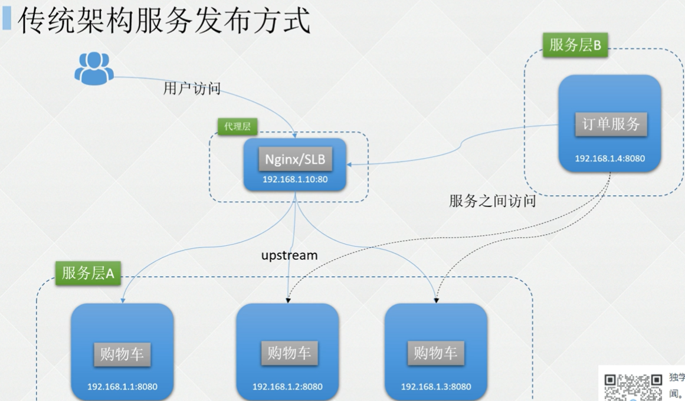
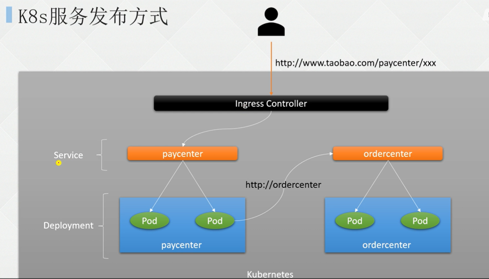
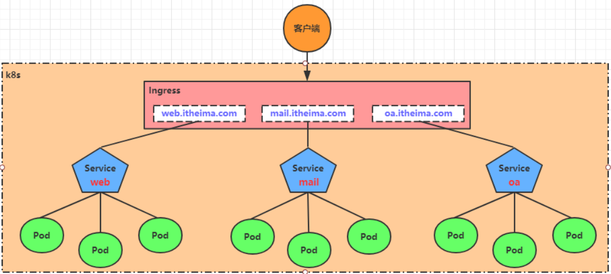
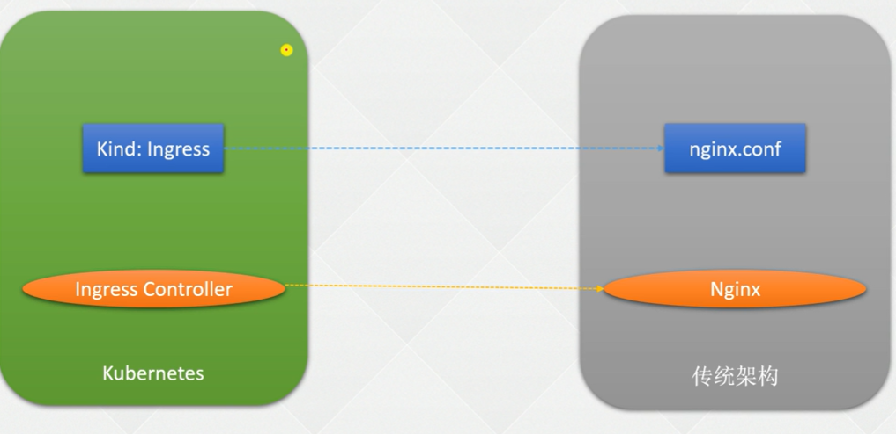
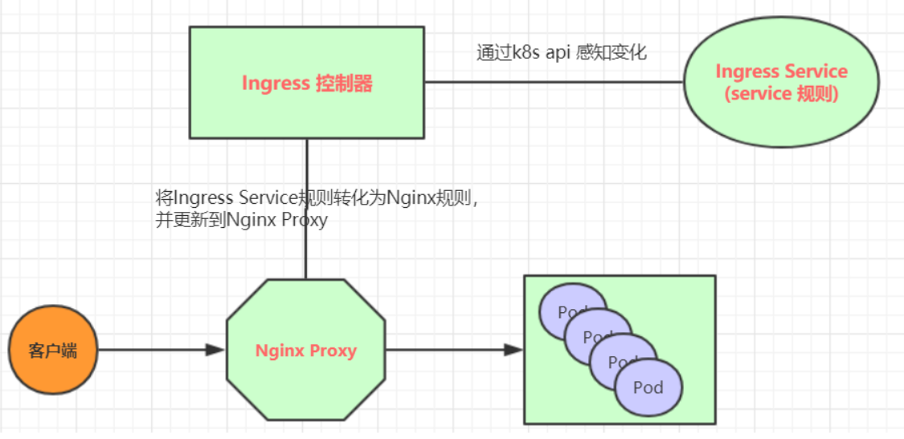

## 传统服务发布方式




## K8S服务发布方式





## **Label 和 Selector** 

Label是kubernetes系统中的一个重要概念。它的作用就是在资源上添加标识，用来对它们进行区分和选择。

Label的特点：

- 一个Label会以key/value键值对的形式附加到各种对象上，如Node、Pod、Service等等
- 一个资源对象可以定义任意数量的Label ，同一个Label也可以被添加到任意数量的资源对象上去
- Label通常在资源对象定义时确定，当然也可以在对象创建后动态添加或者删除

可以通过Label实现资源的多维度分组，以便灵活、方便地进行资源分配、调度、配置、部署等管理工作。

> 一些常用的Label 示例如下：
>
> - 版本标签："version":"release", "version":"stable"......
> - 环境标签："environment":"dev"，"environment":"test"，"environment":"pro"
> - 架构标签："tier":"frontend"，"tier":"backend"

标签定义完毕之后，还要考虑到标签的选择，这就要使用到Label Selector，即：

Label用于给某个资源对象定义标识

Label Selector用于查询和筛选拥有某些标签的资源对象

当前有两种Label Selector：

- 基于等式的Label Selector

  name = slave: 选择所有包含Label中key="name"且value="slave"的对象

  env != production: 选择所有包括Label中的key="env"且value不等于"production"的对象

- 基于集合的Label Selector

  name in (master, slave): 选择所有包含Label中的key="name"且value="master"或"slave"的对象

  name not in (frontend): 选择所有包含Label中的key="name"且value不等于"frontend"的对象

标签的选择条件可以使用多个，此时将多个Label Selector进行组合，使用逗号","进行分隔即可。例如：

```
name=slave，env!=production

name not in (frontend)，env!=production
```


### 定义Label

应用案例：

公司与 xx 银行有一条专属的高速光纤通道，此通道只能与 192.168.7.0 网段进行通信，因此

只能将与 xx 银行通信的应用部署到 192.168.7.0 网段所在的节点上，此时可以对节点添加 Label：

```
# kubectl label node k8s-node02 region=subnet7

node/k8s-node02 labeled
```

然后可以通过 Selector 对其筛选：

```
# kubectl get no -l region=subnet7

NAME       STATUS  ROLES   AGE   VERSION
k8s-node02 Ready   <none>  3d17h v1.12.3
```

最后在 Deployment 或其他控制器中指定将 Pod 部署到该节点：

```
containers:
 ......
dnsPolicy: ClusterFirst
nodeSelector:
  region: subnet7
restartPolicy: Always
......
```

也可以用同样的方式对 Service 添加 Label：

```
# kubectl label svc canary-v1 -n canary-production env=canary version=v1
service/canary-v1 labeled
```

查看该 Service 的标签：

```
# kubectl get svc -n canary-production --show-labels
NAME      TYPE      CLUSTER-IP    EXTERNAL-IP PORT(S)  AGE LABELS
canary-v1 ClusterIP 10.110.253.62 <none>      8080/TCP 24h env=canary,version=v1
```

还可以查看所有 version 为 v1 的 Service： 

```
# kubectl get svc --all-namespaces -l version=v1
NAMESPACE         NAME      TYPE      CLUSTER-IP    EXTERNAL-IP PORT(S) AGE
canary-production canary-v1 ClusterIP 10.110.253.62 <none>      8080/TCP 25h
```

上述演示了对节点、Service 添加自定义标签，对于其他资源的 Label 方式相同。

### Selector选择器

首先使用--show-labels 查看指定资源目前已有的 Label：

```
# kubectl get service --show-labels
NAME        TYPE      CLUSTER-IP   EXTERNAL-IP  PORT(S)  AGE   LABELS
details    ClusterIP  10.99.9.178    <none>     9080/TCP 45h   app=details
kubernetes ClusterIP  10.96.0.1      <none>     443/TCP  3d19h component=apiserver,provider=kubernetes
nginx      ClusterIP  10.106.194.137 <none>     80/TCP   2d21h app=productpage,version=v1
nginx-v2   ClusterIP  10.108.176.132 <none>     80/TCP   2d20h <none>
productpage ClusterIP 10.105.229.52  <none>     9080/TCP 45h   app=productpage,tier=frontend
ratings    ClusterIP  10.96.104.95   <none>     9080/TCP 45h   app=ratings
reviews    ClusterIP  10.102.188.143 <none>     9080/TCP 45h   app=reviews
```

选择匹配 app 为 details 或者 productpage 的 Service：

```
# kubectl get svc -l 'app in (details, productpage)' --show-labels
NAME        TYPE      CLUSTER-IP     EXTERNAL-IP  PORT(S)  AGE  LABELS
details     ClusterIP 10.99.9.178    <none>       9080/TCP 45h  app=details
nginx       ClusterIP 10.106.194.137 <none>       80/TCP 2d21h  app=productpage,version=v1
productpage ClusterIP 10.105.229.52  <none>       9080/TCP 45h  app=productpage,tier=frontend
```

选择 app 为 productpage 或 reviews 但不包括 version=v1 的 svc：

```
# kubectl get svc -l version!=v1,'app in (details, productpage)' --show-labels
NAME        TYPE     CLUSTER-IP    EXTERNAL-IP   PORT(S)   AGE  LABELS
details     ClusterIP 10.99.9.178  <none>        9080/TCP  45h app=details
productpage ClusterIP 10.105.229.52 <none>       9080/TCP  45h app=productpage,tier=frontend
```

选择 label 的 key 名为 app 的 svc：

```
# kubectl get svc -l app --show-labels
NAME        TYPE      CLUSTER-IP   EXTERNAL-IP PORT(S)  AGE   LABELS
details     ClusterIP 10.99.9.178  <none>      9080/TCP 45h   app=details
nginx       ClusterIP 10.106.194.137 <none>    80/TCP 2d21h   app=productpage,version=v1
productpage ClusterIP 10.105.229.52 <none>     9080/TCP 45h   app=productpage,tier=frontend
ratings     ClusterIP 10.96.104.95 <none>      9080/TCP 45h   app=ratings
reviews     ClusterIP 10.102.188.143 <none>    9080/TCP 45h   app=reviews
```

### 修改标签Label

比如将 version=v1 改为 version=v2：

```
# kubectl get svc -n canary-production --show-labels
NAME      TYPE      CLUSTER-IP    EXTERNAL-IP PORT(S)  AGE LABELS
canary-v1 ClusterIP 10.110.253.62 <none>      8080/TCP 26h env=canary,version=v1

# kubectl label svc canary-v1 -n canary-production version=v2 --overwrite
service/canary-v1 labeled

# kubectl get svc -n canary-production --show-labels
NAME      TYPE      CLUSTER-IP    EXTERNAL-IP PORT(S)  AGE LABELS
canary-v1 ClusterIP 10.110.253.62 <none>      8080/TCP 26h env=canary,version=v2
```

### 删除标签Label

删除 key 名为 version 的标签：

```
# kubectl label svc canary-v1 -n canary-production version-
service/canary-v1 labeled

# kubectl get svc -n canary-production --show-labels
NAME      TYPE      CLUSTER-IP    EXTERNAL-IP PORT(S)  AGE  LABELS
canary-v1 ClusterIP 10.110.253.62 <none>      8080/TCP 26h  env=canary
```

##  

## Service 

在kubernetes中，pod是应用程序的载体，我们可以通过pod的ip来访问应用程序，但是pod的ip地址不是固定的，这也就意味着不方便直接采用pod的ip对服务进行访问。

为了解决这个问题，kubernetes提供了Service资源，Service会对提供同一个服务的多个pod进行聚合，并且提供一个统一的入口地址。通过访问Service的入口地址就能访问到后面的pod服务。


Service在很多情况下只是一个概念，真正起作用的其实是kube-proxy服务进程，每个Node节点上都运行着一个kube-proxy服务进程。当创建Service的时候会通过api-server向etcd写入创建的service的信息，而kube-proxy会基于监听的机制发现这种Service的变动，然后**它会将最新的Service信息转换成对应的访问规则**。


### 定义Service

定义 Service 的 yaml 文件如下：

```
kind: Service
apiVersion: v1
metadata:
  name: my-service
spec:
  selector:
    app: nginx
  ports:
    - protocol: TCP
      port: 80
      targetPort: 80
```

创建服务：

```
apiVersion: apps/v1
kind: Deployment
metadata:
  name: nginx-deployment
  labels:
    app: nginx
spec:
  replicas: 3
  selector:
    matchLabels:
      app: nginx
  template:
    metadata:
      labels:
        app: nginx
    spec:
      containers:
      - name: nginx
        image: nginx:1.15.12
        ports:
        - containerPort: 80
```

该示例为 my-service:80 即可访问到具有 app=myapp 标签的 Pod 的 80 端口上。需要注意的是，Service 能够将一个接收端口映射到任意的 targetPort，如果 targetPort 为空，targetPort 将被设置为与 Port 字段相同的值。targetPort 可以设置为一个字符串，引用 backend Pod 的一个端口的名称，这样的话即使更改了 Pod 的端口，也不会对 Service 的访问造成影响。

Kubernetes Service 能够支持 TCP、UDP、SCTP 等协议，默认为 TCP 协议。

### Service类型

- ClusterIP：默认值，它是Kubernetes系统自动分配的虚拟IP，只能在集群内部访问
- NodePort：将Service通过指定的Node上的端口暴露给外部，通过此方法，就可以在集群外部访问服务
- LoadBalancer：使用外接负载均衡器完成到服务的负载分发，注意此模式需要外部云环境支持，成本较高。
- ExternalName： 通过返回定义的 CNAME 别名，没有设置任何类型的代理，需要 1.7 或更高版本 kube-dns 支持。


### NodePort类型

如果将 Service 的 type 字段设置为 NodePort，则 Kubernetes 将从--service-node-port-range 参数指定的范围（默认为 30000-32767）中自动分配端口，也可以手动指定 NodePort，创建该 Service后，集群每个节点都将暴露一个端口，通过某个宿主机的 IP+端口即可访问到后端的应用。

定义一个 NodePort 类型的 Service 格式如下：

```
kind: Service
apiVersion: v1
metadata:
  labels:
    k8s-app: kubernetes-dashboard
  name: kubernetes-dashboard
  namespace: kube-system
spec:
  type: NodePort
  ports:
    - port: 443
      targetPort: 8443
      nodePort: 30000
  selector:
    k8s-app: kubernetes-dashboard
```

### 使用Service 代理 K8s 外部服务

使用场景：

➢ 希望在生产环境中使用某个固定的名称而非 IP 地址访问外部的中间件服务； 

➢ 希望 Service 指向另一个 Namespace 中或其他集群中的服务； 

➢ 正在将工作负载转移到 Kubernetes 集群，但是一部分服务仍运行在 Kubernetes 集群之外的 backend。

```
# cat nginx-svc-external.yaml 
apiVersion: v1
kind: Service
metadata:
  labels:
    app: nginx-svc-external
  name: nginx-svc-external
spec:
  ports:
  - name: http
    port: 80 
    protocol: TCP
    targetPort: 80
  sessionAffinity: None
  type: ClusterIP
# cat nginx-ep-external.yaml 
---
apiVersion: v1
kind: Endpoints
metadata:
  labels:
    app: nginx-svc-external
  name: nginx-svc-external
subsets:
- addresses:
  - ip: 140.205.94.189 
  ports:
  - name: http
    port: 80
    protocol: TCP
```

**Endpoint IP 地址不能是 loopback（127.0.0.0/8）、link-local（169.254.0.0/16）或者 link-local 多播地址（224.0.0.0/24）。**


访问没有 Selector 的 Service 与有 Selector 的 Service 的原理相同，通过 Service 名称即可访问，请求将被路由到用户定义的 Endpoint。


### ExternalName Service

ExternalName Service 是 Service 的特例，它没有 Selector，也没有定义任何端口和 Endpoint，它通过返回该外部服务的别名来提供服务。比如可以定义一个 Service，后端设置为一个外部域名，这样通过 Service 的名称即可访问到该域名。使用 nslookup 解析以下文件定义的 Service，集群的 DNS 服务将返回一个值为my.database.example.com 的 CNAME 记录：

```
kind: Service
apiVersion: v1
metadata:
  name: my-service
  namespace: prod
spec:
  type: ExternalName
  externalName: my.database.example.com
```

### 多端口Service

例如将 Service 的 80 端口代理到后端的 9376,443 端口代理到后端的 9377：

```
kind: Service
apiVersion: v1
metadata:
  name: my-service
spec:
  selector:
    app: myapp
  ports:
  - name: http
    protocol: TCP
    port: 80
    targetPort: 9376
  - name: https
    protocol: TCP
    port: 443
    targetPort: 9377
```

##  **Ingress** 

### Ingress介绍

Ingress 是从 Kubernetes 集群外部访问集群内部服务的入口，在前面课程中已经提到，Service对集群之外暴露服务的主要方式有两种：NotePort和LoadBalancer，但是这两种方式，都有一定的缺点：

- NodePort方式的缺点是会占用很多集群机器的端口，那么当集群服务变多的时候，这个缺点就愈发明显
- LB方式的缺点是每个service需要一个LB，浪费、麻烦，并且需要kubernetes之外设备的支持

基于这种现状，kubernetes提供了Ingress资源对象，Ingress只需要一个NodePort或者一个LB就可以满足暴露多个Service的需求。




实际上，Ingress相当于一个7层的负载均衡器，是kubernetes对反向代理的一个抽象，它的工作原理类似于Nginx，可以理解成在**Ingress里建立诸多映射规则，Ingress Controller通过监听这些配置规则并转化成Nginx的反向代理配置 , 然后对外部提供服务**。在这里有两个核心概念：

- ingress：kubernetes中的一个对象，作用是定义请求如何转发到service的规则
- ingress controller：具体实现反向代理及负载均衡的程序，对ingress定义的规则进行解析，根据配置的规则来实现请求转发，实现方式有很多，比如Nginx, Contour, Haproxy等等





Ingress（以Nginx为例）的工作原理如下：

1. 用户编写Ingress规则，说明哪个域名对应kubernetes集群中的哪个Service
2. Ingress控制器动态感知Ingress服务规则的变化，然后生成一段对应的Nginx反向代理配置
3. Ingress控制器会将生成的Nginx配置写入到一个运行着的Nginx服务中，并动态更新
4. 到此为止，其实真正在工作的就是一个Nginx了，内部配置了用户定义的请求转发规则




### Ingress Controller安装

官方安装文档：https://kubernetes.github.io/ingress-nginx/deploy/#bare-metal-clusters


```
# kubectl create -f deploy-ingress.yaml 
namespace/ingress-nginx created
serviceaccount/ingress-nginx created
serviceaccount/ingress-nginx-admission created
role.rbac.authorization.k8s.io/ingress-nginx created
role.rbac.authorization.k8s.io/ingress-nginx-admission created
clusterrole.rbac.authorization.k8s.io/ingress-nginx created
clusterrole.rbac.authorization.k8s.io/ingress-nginx-admission created
rolebinding.rbac.authorization.k8s.io/ingress-nginx created
rolebinding.rbac.authorization.k8s.io/ingress-nginx-admission created
clusterrolebinding.rbac.authorization.k8s.io/ingress-nginx created
clusterrolebinding.rbac.authorization.k8s.io/ingress-nginx-admission 
created
configmap/ingress-nginx-controller created
service/ingress-nginx-controller created
service/ingress-nginx-controller-admission created
deployment.apps/ingress-nginx-controller created
job.batch/ingress-nginx-admission-create created
job.batch/ingress-nginx-admission-patch created
ingressclass.networking.k8s.io/nginx created
validatingwebhookconfiguration.admissionregistration.k8s.io/ingressnginx-admission created
```

### 使用域名发布K8s的服务

创建一个 web 服务：

```
kubectl create deploy nginx --image=registry.cnbeijing.aliyuncs.com/dotbalo/nginx:1.15.12
```

暴露服务：

```
kubectl expose deploy nginx --port 80
```

创建 Ingress：

vim web-ingress.yaml 

```
apiVersion: networking.k8s.io/v1 # k8s >= 1.22 必须 v1
kind: Ingress
metadata:
  name: nginx-ingress
spec:
  ingressClassName: nginx
  rules:
  - host: nginx.test.com
    http:
      paths:
      - backend:
          service:
            name: nginx
            port:
              number: 80
        path: /
        pathType: ImplementationSpecific
```

pathType：路径的匹配方式，目前有 ImplementationSpecific、Exact 和 Prefix 方式

​    ◆ Exact：精确匹配，比如配置的 path 为/bar，那么/bar/将不能被路由；

​    ◆ Prefix：前缀匹配，基于以 / 分隔的 URL 路径。比如 path 为/abc，可以匹配到/abc/bbb 等，比较常用的配置；

​    ◆ ImplementationSpecific：这种类型的路由匹配根据 Ingress Controller 来实现，可以当做一个单独的类型，

​                                                    也可以当做 Prefix 和 Exact。ImplementationSpecific是 1.18 版本引入 Prefix 和 Exact 的默认配置；


### Ingress特例：不配置域名发布服务

\# **vim ingress-no-host.yaml** 

```
apiVersion: networking.k8s.io/v1 # k8s >= 1.22 必须 v1
kind: Ingress
metadata:
  name: nginx-ingress-no-host
spec:
  ingressClassName: nginx
  rules:
  - http:
      paths:
      - backend:
          service:
            name: nginx
            port:
            number: 80
        path: /no-host
        pathType: ImplementationSpecific
```

### Ingress接口变化解析

1.19 之前的 v1beta1:

```
apiVersion: networking.k8s.io/v1beta1 # 1.22 之前可以使用 v1beta1
kind: Ingress
metadata:
  name: simple-fanout-example
  annotations:
    kubernetes.io/ingress.class: "nginx" # 不同的 controller，ingress.class可能不一致
spec:
  rules:
  - host: foo.bar.com
    http:
      paths:
      - path: /foo
        pathType: Prefix
        backend:
          serviceName: service1
          servicePort: 4200
      - path: /bar
        pathType: ImplementationSpecific
        backend:
          serviceName: service2
          servicePort: 8080
```

