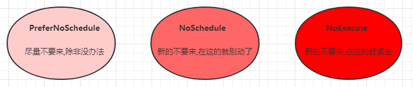

## JOB 

Job，主要用于负责**批量处理(一次要处理指定数量任务)**短暂的**一次性(每个任务仅运行一次就结束)**任务。Job特点如下：

- 当Job创建的pod执行成功结束时，Job将记录成功结束的pod数量
- 当成功结束的pod达到指定的数量时，Job将完成执行


Job的资源清单文件：

```yaml
apiVersion: batch/v1 # 版本号
kind: Job # 类型       
metadata: # 元数据
  name: # rs名称 
  namespace: # 所属命名空间 
  labels: #标签
    controller: job
spec: # 详情描述
  completions: 1 # 指定job需要成功运行Pods的次数。默认值: 1
  parallelism: 1 # 指定job在任一时刻应该并发运行Pods的数量。默认值: 1
  activeDeadlineSeconds: 30 # 指定job可运行的时间期限，超过时间还未结束，系统将会尝试进行终止。
  backoffLimit: 6 # 指定job失败后进行重试的次数。默认是6
  manualSelector: true # 是否可以使用selector选择器选择pod，默认是false
  selector: # 选择器，通过它指定该控制器管理哪些pod
    matchLabels:      # Labels匹配规则
      app: counter-pod
    matchExpressions: # Expressions匹配规则
      - {key: app, operator: In, values: [counter-pod]}
  template: # 模板，当副本数量不足时，会根据下面的模板创建pod副本
    metadata:
      labels:
        app: counter-pod
    spec:
      restartPolicy: Never # 重启策略只能设置为Never或者OnFailure
      containers:
      - name: counter
        image: busybox:1.30
        command: ["bin/sh","-c","for i in 9 8 7 6 5 4 3 2 1; do echo $i;sleep 2;done"]
```

**关于重启策略设置的说明：**    

如果指定为OnFailure，则job会在pod出现故障时重启容器，而不是创建pod，failed次数不变

如果指定为Never，则job会在pod出现故障时创建新的pod，并且故障pod不会消失，也不会重启，failed次数加1

 如果指定为Always的话，就意味着一直重启，意味着job任务会重复去执行了，当然不对，所以不能设置为Always


### 创建JOB

创建pc-job.yaml，内容如下：

```yaml
apiVersion: batch/v1
kind: Job      
metadata:
  name: pc-job
spec:
  manualSelector: true
  selector:
    matchLabels:
      app: counter-pod
  template:
    metadata:
      labels:
        app: counter-pod
    spec:
      restartPolicy: Never
      containers:
      - name: counter
        image: busybox:1.30
        command: ["bin/sh","-c","for i in 9 8 7 6 5 4 3 2 1; do echo $i;sleep 3;done"]
```


```shell
# 创建job
[root@k8s-master01 ~]# kubectl create -f pc-job.yaml
job.batch/pc-job created

# 查看job
[root@k8s-master01 ~]# kubectl get job  -o wide  -w
NAME     COMPLETIONS   DURATION   AGE   CONTAINERS   IMAGES         SELECTOR
pc-job   0/1           21s        21s   counter      busybox:1.30   app=counter-pod
pc-job   1/1           31s        79s   counter      busybox:1.30   app=counter-pod

# 通过观察pod状态可以看到，pod在运行完毕任务后，就会变成Completed状态
[root@k8s-master01 ~]# kubectl get pods  -w
NAME           READY   STATUS     RESTARTS      AGE
pc-job-rxg96   1/1     Running     0            29s
pc-job-rxg96   0/1     Completed   0            33s

# 接下来，调整下pod运行的总数量和并行数量 即：在spec下设置下面两个选项
#  completions: 6 # 指定job需要成功运行Pods的次数为6
#  parallelism: 3 # 指定job并发运行Pods的数量为3
#  然后重新运行job，观察效果，此时会发现，job会每次运行3个pod，总共执行了6个pod
[root@k8s-master01 ~]# kubectl get pods  -w
NAME           READY   STATUS    RESTARTS   AGE
pc-job-684ft   1/1     Running   0          5s
pc-job-jhj49   1/1     Running   0          5s
pc-job-pfcvh   1/1     Running   0          5s
pc-job-684ft   0/1     Completed   0          11s
pc-job-v7rhr   0/1     Pending     0          0s
pc-job-v7rhr   0/1     Pending     0          0s
pc-job-v7rhr   0/1     ContainerCreating   0          0s
pc-job-jhj49   0/1     Completed           0          11s
pc-job-fhwf7   0/1     Pending             0          0s
pc-job-fhwf7   0/1     Pending             0          0s
pc-job-pfcvh   0/1     Completed           0          11s
pc-job-5vg2j   0/1     Pending             0          0s
pc-job-fhwf7   0/1     ContainerCreating   0          0s
pc-job-5vg2j   0/1     Pending             0          0s
pc-job-5vg2j   0/1     ContainerCreating   0          0s
pc-job-fhwf7   1/1     Running             0          2s
pc-job-v7rhr   1/1     Running             0          2s
pc-job-5vg2j   1/1     Running             0          3s
pc-job-fhwf7   0/1     Completed           0          12s
pc-job-v7rhr   0/1     Completed           0          12s
pc-job-5vg2j   0/1     Completed           0          12s

# 删除job
[root@k8s-master01 ~]# kubectl delete -f pc-job.yaml
job.batch "pc-job" deleted
```


## CronJob

CronJob用于以时间为基准周期性地执行任务，这些自动化任务和运行在Linux或UNIX系统上的CronJob一样。CronJob对于创建定期和重

复任务非常有用，例如执行备份任务、周期性调度程序接口、发送电子邮件等。


对于Kubernetes 1.8以前的版本，需要添加--runtime-config=batch/v2alpha1=true参数至APIServer中，然后重启APIServer和

Controller Manager用于启用API，对于1.8以后的版本无须修改任何参数，可以直接使用，本节的示例基于1.8以上的版本。


### CronJob的资源清单文件

```yaml
apiVersion: batch/v1beta1 # 版本号
kind: CronJob # 类型       
metadata: # 元数据
  name: # rs名称 
  namespace: # 所属命名空间 
  labels: #标签
    controller: cronjob
spec: # 详情描述
  schedule: # cron格式的作业调度运行时间点,用于控制任务在什么时间执行
  concurrencyPolicy: # 并发执行策略，用于定义前一次作业运行尚未完成时是否以及如何运行后一次的作业
  failedJobHistoryLimit: # 为失败的任务执行保留的历史记录数，默认为1
  successfulJobHistoryLimit: # 为成功的任务执行保留的历史记录数，默认为3
  startingDeadlineSeconds: # 启动作业错误的超时时长
  jobTemplate: # job控制器模板，用于为cronjob控制器生成job对象;下面其实就是job的定义
    metadata:
    spec:
      completions: 1
      parallelism: 1
      activeDeadlineSeconds: 30
      backoffLimit: 6
      manualSelector: true
      selector:
        matchLabels:
          app: counter-pod
        matchExpressions: 规则
          - {key: app, operator: In, values: [counter-pod]}
      template:
        metadata:
          labels:
            app: counter-pod
        spec:
          restartPolicy: Never 
          containers:
          - name: counter
            image: busybox:1.30
            command: ["bin/sh","-c","for i in 9 8 7 6 5 4 3 2 1; do echo $i;sleep 20;done"]
```

```markdown
需要重点解释的几个选项：
schedule: cron表达式，用于指定任务的执行时间
    */1    *      *    *     *
    <分钟> <小时> <日> <月份> <星期>

    分钟 值从 0 到 59.
    小时 值从 0 到 23.
    日 值从 1 到 31.
    月 值从 1 到 12.
    星期 值从 0 到 6, 0 代表星期日
    多个时间可以用逗号隔开； 范围可以用连字符给出；*可以作为通配符； /表示每...

concurrencyPolicy:  #并发调度策略
    Allow:   允许Jobs并发运行(默认)
    Forbid:  禁止并发运行，如果上一次运行尚未完成，则跳过下一次运行
    Replace: 替换，取消当前正在运行的作业并用新作业替换它

suspend：如果设置为true，则暂停后续的任务，默认为false。

successfulJobsHistoryLimit：保留多少已完成的任务，按需配置

failedJobsHistoryLimit：保留多少失败的任务。
```


### 创建CronJob

创建CronJob有两种方式，一种是直接使用kubectl创建，一种是使用yaml文件创建。

使用kubectl创建CronJob的命令如下：

```shell
kubectl run hello --schedule="*/1 * * * *" --restart=OnFailure --image=busybox -- /bin/sh -c "date; echo Hello from the Kubernetes cluster"
```

对应的yaml文件如下：

```yaml
apiVersion: batch/v1beta1
kind: CronJob
metadata:
  name: hello
spec:
  schedule: "*/1 * * * *"
  jobTemplate:
    spec:
      template:
        spec:
          containers:
          - name: hello
            image: busybox
            args:
            - /bin/sh
            - -c
            - date; echo Hello from the Kubernetes cluster
          restartPolicy: OnFailure
```

**说明：本例创建一个每分钟执行一次、打印当前时间和Hello from the Kubernetes cluster的计划任务。**


查看创建的CronJob：

```shell
$ kubectl get cj
NAME    SCHEDULE      SUSPEND   ACTIVE   LAST SCHEDULE   AGE
hello   */1 * * * *   False     0        <none>          5s
```

等待1分钟可以查看执行的任务（Jobs）：

```shell
$ kubectl get jobs
NAME               COMPLETIONS   DURATION   AGE
hello-1558779360   1/1           23s        32s
```

CronJob每次调用任务的时候会创建一个Pod执行命令，执行完任务后，Pod状态就会变成Completed，如下所示：

```shell
$ kubectl get po 
NAME                          READY   STATUS      RESTARTS   AGE
hello-1558779360-jcp4r        0/1     Completed   0          37s
```

可以通过logs查看Pod的执行日志：

```shell
$ kubectl logs -f hello-1558779360-jcp4r 
Sat May 25 10:16:23 UTC 2019
Hello from the Kubernetes cluster
```

如果要删除CronJob，直接使用delete即可：

```shell
kubectl delete cronjob hello
```


## 临时容器

k8s1.16+，在原有的Pod上，添加一个临时的Container，这个Container可以包含我们排查问题所有的工具，netstat、ps、top，jstat、jmap。


### 临时容器启用配置

```
所有master节点的api-server、controller-manager、kube-scheduler组件添加 --feature-gates=EphemeralContainers=true

所有节点的kubelet、kube-proxy组件添加 --feature-gates=EphemeralContainers=true
```

#### api-server

vi /usr/lib/systemd/system/kube-apiserver.service

```
[Unit]
Description=Kubernetes API Server
Documentation=https://github.com/kubernetes/kubernetes
After=network.target

[Service]
Restart=on-failure
RestartSec=10s
LimitNOFILE=65535
ExecStart=/usr/local/bin/kube-apiserver \
      --v=2  \
      --logtostderr=true  \
      --allow-privileged=true  \
      --bind-address=0.0.0.0  \
      --secure-port=6443  \
      --insecure-port=0  \
      --advertise-address=192.168.11.200 \
      --service-cluster-ip-range=10.96.0.0/12  \
      --service-node-port-range=30000-32767  \
      --etcd-servers=https://192.168.11.150:2379,https://192.168.11.151:2379,https://192.168.11.152:2379 \
      --etcd-cafile=/etc/etcd/ssl/etcd-ca.pem  \
      --etcd-certfile=/etc/etcd/ssl/etcd.pem  \
      --etcd-keyfile=/etc/etcd/ssl/etcd-key.pem  \
      --client-ca-file=/etc/kubernetes/pki/ca.pem  \
      --tls-cert-file=/etc/kubernetes/pki/apiserver.pem  \
      --tls-private-key-file=/etc/kubernetes/pki/apiserver-key.pem  \
      --kubelet-client-certificate=/etc/kubernetes/pki/apiserver.pem  \
      --kubelet-client-key=/etc/kubernetes/pki/apiserver-key.pem  \
      --service-account-key-file=/etc/kubernetes/pki/sa.pub  \
      --kubelet-preferred-address-types=InternalIP,ExternalIP,Hostname  \
      --enable-admission-plugins=NamespaceLifecycle,LimitRanger,ServiceAccount,DefaultStorageClass,DefaultTolerationSeconds,NodeRestriction,ResourceQuota  \
      --authorization-mode=Node,RBAC  \
      --enable-bootstrap-token-auth=true  \
      --requestheader-client-ca-file=/etc/kubernetes/pki/front-proxy-ca.pem  \
      --proxy-client-cert-file=/etc/kubernetes/pki/front-proxy-client.pem  \
      --proxy-client-key-file=/etc/kubernetes/pki/front-proxy-client-key.pem  \
      --requestheader-allowed-names=aggregator  \
      --requestheader-group-headers=X-Remote-Group  \
      --requestheader-extra-headers-prefix=X-Remote-Extra-  \
      --requestheader-username-headers=X-Remote-User \
      --feature-gates=EphemeralContainers=true
      # --token-auth-file=/etc/kubernetes/token.csv

[Install]
WantedBy=multi-user.target
```

重启api-server

```shell
systemctl daemon-reload && systemctl restart kube-apiserver.service
```


#### controller-manager

vi /usr/lib/systemd/system/kube-controller-manager.service

```
[Unit]
Description=Kubernetes Controller Manager
Documentation=https://github.com/kubernetes/kubernetes
After=network.target

[Service]
Restart=always
RestartSec=10s
ExecStart=/usr/local/bin/kube-controller-manager \
      --v=2 \
      --logtostderr=true \
      --address=127.0.0.1 \
      --root-ca-file=/etc/kubernetes/pki/ca.pem \
      --cluster-signing-cert-file=/etc/kubernetes/pki/ca.pem \
      --cluster-signing-key-file=/etc/kubernetes/pki/ca-key.pem \
      --service-account-private-key-file=/etc/kubernetes/pki/sa.key \
      --kubeconfig=/etc/kubernetes/controller-manager.kubeconfig \
      --leader-elect=true \
      --experimental-cluster-signing-duration=876000h0m0s \
      --feature-gates=RotateKubeletClientCertificate=true,RotateKubeletServerCertificate=true \
      --use-service-account-credentials=true \
      --node-monitor-grace-period=40s \
      --node-monitor-period=5s \
      --pod-eviction-timeout=2m0s \
      --controllers=*,bootstrapsigner,tokencleaner \
      --allocate-node-cidrs=true \
      --cluster-cidr=10.244.0.0/16 \
      --requestheader-client-ca-file=/etc/kubernetes/pki/front-proxy-ca.pem \
      --feature-gates=EphemeralContainers=true \
      --node-cidr-mask-size=24
      

[Install]
WantedBy=multi-user.target
```

重启controller-manager

```shell
systemctl daemon-reload && systemctl restart kube-controller-manager.service
```

#### kube-scheduler

vi  /usr/lib/systemd/system/kube-scheduler.service

```
[Unit]
Description=Kubernetes Scheduler
Documentation=https://github.com/kubernetes/kubernetes
After=network.target

[Service]
Restart=always
RestartSec=10s
ExecStart=/usr/local/bin/kube-scheduler \
      --v=2 \
      --logtostderr=true \
      --address=127.0.0.1 \
      --leader-elect=true \
      --feature-gates=EphemeralContainers=true \
      --kubeconfig=/etc/kubernetes/scheduler.kubeconfig


[Install]
WantedBy=multi-user.target
```

重启kube-scheduler

```shell
systemctl daemon-reload && systemctl restart kube-scheduler.service
```

#### kubelet

vi /etc/systemd/system/kubelet.service.d/10-kubelet.conf

```
[Service]
Environment="KUBELET_KUBECONFIG_ARGS=--kubeconfig=/etc/kubernetes/kubelet.kubeconfig --bootstrap-kubeconfig=/etc/kubernetes/bootstrap-kubelet.kubeconfig"
Environment="KUBELET_SYSTEM_ARGS=--network-plugin=cni --cni-conf-dir=/etc/cni/net.d --cni-bin-dir=/opt/cni/bin"
Environment="KUBELET_CONFIG_ARGS=--config=/etc/kubernetes/kubelet-conf.yml  --pod-infra-container-image=registry.cn-hangzhou.aliyuncs.com/google_containers/pause-amd64:3.1"
Environment="KUBELET_EXTRA_ARGS=--tls-cipher-suites=TLS_ECDHE_RSA_WITH_AES_128_GCM_SHA256,TLS_ECDHE_RSA_WITH_AES_256_GCM_SHA384 --feature-gates=EphemeralContainers=true    --image-pull-progress-deadline=30m"
ExecStart=
ExecStart=/usr/local/bin/kubelet $KUBELET_KUBECONFIG_ARGS $KUBELET_CONFIG_ARGS $KUBELET_SYSTEM_ARGS $KUBELET_EXTRA_ARGS
```

重启kubelet

```shell
systemctl daemon-reload  && systemctl restart kubelet.service
```


#### kube-proxy

vi /usr/lib/systemd/system/kube-proxy.service

```
[Unit]
Description=Kubernetes Kube Proxy
Documentation=https://github.com/kubernetes/kubernetes
After=network.target

[Service]
ExecStart=/usr/local/bin/kube-proxy \
  --config=/etc/kubernetes/kube-proxy.conf \
  --feature-gates=EphemeralContainers=true \
  --v=2

Restart=always
RestartSec=10s

[Install]
WantedBy=multi-user.target
```

重启kube-proxy

```shell
systemctl daemon-reload && systemctl restart kube-proxy.service
```


查看临时容器是否开启

```shell
# kubelet -h |grep EphemeralContainers
EphemeralContainers=true|false (ALPHA - default=false)
```


## Taint & Toleration

### 概念

Taint（污点）和 Toleration（容忍）可以作用于 node 和 pod 上，其目的是优化 pod 在集群间的调度，来决定是否允许Pod调度过来。

**污点（Taints）**

Node被设置上污点之后就和Pod之间存在了一种相斥的关系，进而拒绝Pod调度进来，甚至可以将已经存在的Pod驱逐出去。

污点的格式为：`key=value:effect`, key和value是污点的标签，effect描述污点的作用，支持如下三个选项：

- PreferNoSchedule：kubernetes将尽量避免把Pod调度到具有该污点的Node上，除非没有其他节点可调度
- NoSchedule：kubernetes将不会把Pod调度到具有该污点的Node上，但不会影响当前Node上已存在的Pod
- NoExecute：kubernetes将不会把Pod调度到具有该污点的Node上，同时也会将Node上已存在的Pod驱离




使用kubectl设置和去除污点的命令示例如下：

```shell
# 设置污点
kubectl taint nodes node1 key=value:effect

#查看节点的污点
kubectl describe node k8s-node01 | grep Taint

# 去除污点
kubectl taint nodes node1 key:effect-

# 去除所有污点
kubectl taint nodes node1 key-
```

**容忍（Toleration）**

上面介绍了污点的作用，我们可以在node上添加污点用于拒绝pod调度上来，但是如果就是想将一个pod调度到一个有污点的node上去，这时候应该怎么做呢？这就要使用到**容忍**。


### 用例

给节点增加一个Taint：

```shell
[root@k8s-master01 ~]# kubectl taint nodes k8s-node01 key=value:NoSchedule
node/k8s-node01 tainted
```

上述命令给k8s-node01增加一个Taint，它的key对应的就是键，value对应就是值，effect对应的就是NoSchedule。这表明只有和这个Taint相匹配的Toleration的Pod才能够被分配到k8s-node01节点上。按如下方式在PodSpec中定义Pod的Toleration，就可以将Pod部署到该节点上。

方式一：

```yaml
tolerations:
- key: "key"
  operator: "Equal"
  value: "value"
  effect: "NoSchedule"
```

方式二：

```yaml
tolerations:
- key: "key"
  operator: "Exists"
  effect: "NoSchedule"
```

一个Toleration和一个Taint相匹配是指它们有一样的key和effect，并且如果operator是Exists（此时toleration不指定value）或者

operator是Equal，则它们的value应该相等。


注意两种情况：

 **如果一个Toleration的key为空且operator为Exists，表示这个Toleration与任意的key、value和effect都匹配，即这个Toleration能容忍任意的Taint：**

```yaml
tolerations:
- operator: "Exists"
```

**如果一个Toleration的effect为空，则key与之相同的相匹配的Taint的effect可以是任意值：**

```yaml
tolerations:
- key: "key"
  operator: "Exists"
```

上述例子使用到effect的一个值NoSchedule，也可以使用PreferNoSchedule，该值定义尽量避免将Pod调度到存在其不能容忍的Taint的

节点上，但并不是强制的。effect的值还可以设置为NoExecute。


一个节点可以设置多个Taint，也可以给一个Pod添加多个Toleration。Kubernetes处理多个Taint和Toleration的过程就像一个过滤器：

从一个节点的所有Taint开始遍历，过滤掉那些Pod中存在与之相匹配的Toleration的Taint。余下未被过滤的Taint的effect值决定了Pod是

否会被分配到该节点，特别是以下情况：

  **1)如果未被过滤的Taint中存在一个以上effect值为NoSchedule的Taint，则Kubernetes不会将Pod分配到该节点。**

  **2)如果未被过滤的Taint中不存在effect值为NoExecute的Taint，但是存在effect值为PreferNoSchedule的Taint，则Kubernetes会尝试**

​	**将Pod分配到该节点。**

  **3)如果未被过滤的Taint中存在一个以上effect值为NoExecute的Taint，则Kubernetes不会将Pod分配到该节点（如果Pod还未在节点上	 运行），或者将Pod从该节点驱逐（如果Pod已经在节点上运行）。**


例如，假设给一个节点添加了以下的Taint：

```shell
kubectl taint nodes k8s-node01 key1=value1:NoSchedule
kubectl taint nodes k8s-node01 key1=value1:NoExecute
kubectl taint nodes k8s-node01 key2=value2:NoSchedule
```

然后存在一个Pod，它有两个Toleration：

```yaml
tolerations:
- key: "key1"
  operator: "Equal"
  value: "value1"
  effect: "NoSchedule"
- key: "key1"
  operator: "Equal"
  value: "value1"
  effect: "NoExecute"
```

在上述例子中，该Pod不会被分配到上述节点，因为没有匹配第三个Taint。但是如果给节点添加上述3个Taint之前，该Pod已经在上述节

点中运行，那么它不会被驱逐，还会继续运行在这个节点上，因为第3个Taint是唯一不能被这个Pod容忍的。


​		通常情况下，如果给一个节点添加了一个effect值为NoExecute的Taint，则任何不能容忍这个Taint的Pod都会马上被驱逐，任何可以

容忍这个Taint的Pod都不会被驱逐。但是，如果Pod存在一个effect值为NoExecute的Toleration指定了可选属性tolerationSeconds的

值，则该值表示是在给节点添加了上述Taint之后Pod还能继续在该节点上运行的时间，例如：

```yaml
tolerations:
- key: "key1"
  operator: "Equal"
  value: "value1"
  effect: "NoExecute"
  tolerationSeconds: 3600
```

表示如果这个Pod正在运行，然后一个匹配的Taint被添加到其所在的节点，那么Pod还将继续在节点上运行3600秒，然后被驱逐。如果

在此之前上述Taint被删除了，则Pod不会被驱逐。


### 总结

通过Taint和Toleration可以灵活地让Pod避开某些节点或者将Pod从某些节点被驱逐。下面是几种情况。

#### 1)专用节点

如果想将某些节点专门分配给特定的一组用户使用，可以给这些节点添加一个Taint（kubectl taint nodes nodename 

dedicated=groupName:NoSchedule），然后给这组用户的Pod添加一个相对应的Toleration。拥有上述Toleration的Pod就能够被分配

到上述专用节点，同时也能够被分配到集群中的其他节点。如果只希望这些Pod只能分配到上述专用节点中，那么还需要给这些专用节点

另外添加一个和上述Taint类似的Label（例如：dedicated=groupName），然后给Pod增加节点亲和性要求或者使用NodeSelector，就

能将Pod只分配到添加了dedicated=groupName标签的节点上。


#### 2)特殊硬件的节点

在部分节点上配备了特殊硬件（比如GPU）的集群中，我们只允许特定的Pod才能部署在这些节点上。这时可以使用Taint进行控制，添加

Taint如kubectl taint nodes nodename special=true:NoSchedule或者kubectl taint nodes nodename 

special=true:PreferNoSchedule，然后给需要部署在这些节点上的Pod添加相匹配的Toleration即可。


#### 3)基于Taint的驱逐

​		之前提到过Taint的effect值NoExecute，它会影响已经在节点上运行的Pod。如果Pod不能忍受effect值为NoExecute的Taint，那么

Pod将会被马上驱逐。如果能够忍受effect值为NoExecute的Taint，但是在Toleration定义中没有指定tolerationSeconds，则Pod还会一

直在这个节点上运行。

​		在Kubernetes 1.6版以后已经支持（alpha）当某种条件为真时，Node Controller会自动给节点添加一个Taint，用以表示节点的

问题。当前内置的Taint包括：

```
node.kubernetes.io/not-ready：节点未准备好，相当于节点状态Ready的值为False。

node.kubernetes.io/unreachable：Node Controller访问不到节点，相当于节点状态Ready的值为Unknown。

node.kubernetes.io/out-of-disk：节点磁盘耗尽。

node.kubernetes.io/memory-pressure：节点存在内存压力。

node.kubernetes.io/disk-pressure：节点存在磁盘压力。

node.kubernetes.io/network-unavailable：节点网络不可达。

node.kubernetes.io/unschedulable：节点不可调度。

node.cloudprovider.kubernetes.io/uninitialized：如果Kubelet启动时指定了一个外部的cloudprovider，它将给当前节点添加													一个Taint将其标记为不可用。在cloud-controller-manager的一个													controller初始化这个节点后，Kubelet将删除这个Taint。
```

​		使用这个alpha功能特性，结合tolerationSeconds，Pod就可以指定当节点出现一个或全部上述问题时，Pod还能在这个节点上运行

多长时间。


​		比如，一个使用了很多本地状态的应用程序在网络断开时，仍然希望停留在当前节点上运行一段时间，愿意等待网络恢复以避免被驱

逐。在这种情况下，Pod的Toleration可以这样配置：

```yaml
tolerations:
- key: "node.alpha.kubernetes.io/unreachable"
  operator: "Exists"
  effect: "NoExecute"
  tolerationSeconds: 6000
```


**Kubernetes会自动给Pod添加一个key为node.kubernetes.io/not-ready的Toleration并配置tolerationSeconds=300，同样也会**

**给Pod添加一个key为node.kubernetes.io/unreachable的Toleration并配置tolerationSeconds=300，除非用户自定义了上**

**key，否则会采用这个默认设置。**


这种自动添加Toleration的机制保证了在其中一种问题被检测到时，Pod默认能够继续停留在当前节点运行5分钟。这两个默认Toleration

是由DefaultTolerationSeconds admission controller添加的。


​		DaemonSet中的Pod被创建时，针对以下Taint自动添加的NoExecute的Toleration将不会指定tolerationSeconds：

```
node.alpha.kubernetes.io/unreachable

node.kubernetes.io/not-ready
```

这保证了出现上述问题时DaemonSet中的Pod永远不会被驱逐。


## Affinity

### POD调度仍然存在的问题


```
某些pod优先选择有ssd=true标签的节点，如果没有在考虑部署到其他节点

某些pod需要部署在ssd=true和type=physical的节点上，但是优先部署在ssd=true的节点上

同一个应用的POD不同的副本或者同一个项目的应用尽量或必须不部署在同一个节点或者符合某个标签的一类节点上或者不同的区域

相互依赖的两个POD尽量或必须部署在同一个节点上
```


### Affinity分类

Affinity主要分为三类：

- nodeAffinity(node亲和性）: 以node为目标，解决pod可以调度到哪些node的问题
- podAffinity(pod亲和性) : 以pod为目标，解决pod可以和哪些已存在的pod部署在同一个拓扑域中的问题
- podAntiAffinity(pod反亲和性) : 以pod为目标，解决pod不能和哪些已存在pod部署在同一个拓扑域中的问题

每个分类包含requiredDuringSchedulingIgnoredDuringExecution和preferredDuringSchedulingIgnoredDuringExecution两个小分类

关于亲和性(反亲和性)使用场景的说明：

**亲和性**：如果两个应用频繁交互，那就有必要利用亲和性让两个应用的尽可能的靠近，这样可以减少因网络通信而带来的性能损耗。

**反亲和性**：当应用的采用多副本部署时，有必要采用反亲和性让各个应用实例打散分布在各个node上，这样可以提高服务的高可用性。


### node亲和性配置

```yaml
apiVersion: v1
kind: Pod
metadata:
  name: nodeaffinity-required
spec:
  containers:
  - name: nginx
    image: nginx:1.17.1
  affinity:  #亲和性设置
    nodeAffinity: #设置node亲和性
      requiredDuringSchedulingIgnoredDuringExecution: # 硬限制
        nodeSelectorTerms:  #节点选择器
        - matchExpressions: # 匹配env的值在["xxx","yyy"]中的标签
          - key: nodeenv
            operator: In    #关系符 支持Exists, DoesNotExist, In, NotIn, Gt, Lt
            values: ["xxx","yyy"]
      preferredDuringSchedulingIgnoredDuringExecution:  #软限制
      - weight: 1  #倾向权重，在范围1-100。
        preference:  #一个节点选择器项，与相应的权重相关联
          matchExpressions:
          - key: annother-node-label-key
            operator: In
            values:
            - annother-node-label-value
```


### POD亲和力反亲和力配置

```yaml
apiVersion: v1
kind: Pod
metadata:
  name: pod-affinity
spec:
  containers:
  - name: nginx
    image: nginx:1.17.1
  affinity:  #亲和性设置
    podAffinity: #设置node亲和性
      requiredDuringSchedulingIgnoredDuringExecution: # 硬限制
      - labelSelector:  #pod选择器
          matchExpressions: # security的值是["S1"]
          - key: security
            operator: In    #关系符 支持Exists, DoesNotExist, In, NotIn, Gt, Lt
            values: 
            - S1
        topologyKey: kubernetes.io/hostname   #匹配的拓扑域的key，也就是节点上的label key，key和value相同的为同一个域
    podAntiAffinity:
      preferredDuringSchedulingIgnoredDuringExecution: # 硬限制
      weight: 1  #倾向权重，在范围1-100。
      podAffinityTerm:        
        labelSelector:  #标签选择器
          matchExpressions: # security的值是["S2"]
          - key: security
            operator: In    #关系符 支持Exists, DoesNotExist, In, NotIn, Gt, Lt
            values: 
            - S2
        namespaces:  #和哪个命名空间的pod进行匹配，为空为当前命名空间
        -default
        topologyKey: kubernetes.io/hostname      
```


### 部署至不同的宿主机

同一个应用部署在不同的宿主机

vi   must-be-diff-nodes.yml

```yaml
apiVersion: apps/v1
kind: Deployment
metadata:
  name: must-be-diff-nodes
  labels:
    app: must-be-diff-nodes
spec:
  replicas: 3
  selector:
    matchLabels:
      app: must-be-diff-nodes
  template:
    metadata:  
      labels:
        app: must-be-diff-nodes
    spec:          
      containers:
      - name: nginx
        image: nginx:1.17.1
        imagePullPolicy: IfNotPresent
        
      affinity:  #亲和性设置
        podAntiAffinity: #设置pod亲和性
          requiredDuringSchedulingIgnoredDuringExecution: # 硬限制
          - labelSelector:  #pod选择器
              matchExpressions: # security的值是["S1"]
              - key: app
                operator: In    #关系符 支持Exists, DoesNotExist, In, NotIn, Gt, Lt
                values: 
                - must-be-diff-nodes
            topologyKey: kubernetes.io/hostname   #匹配的拓扑域的key，也就是节点上的label key，key和value相同的为同一个域
 
```

通过反亲和性设置，如果节点上已经部署了该应用，就不能再部署了。


### 尽量调度到高配置服务器

vi prefer-ssd.yml

```yaml
apiVersion: apps/v1
kind: Deployment
metadata:
  name: prefer-ssd
  labels:
    app: prefer-ssd
spec:
  replicas: 1
  selector:
    matchLabels:
      app: prefer-ssd
  template:
    metadata:  
      labels:
        app: prefer-ssd
    spec:          
      containers:
      - name: nginx
        image: nginx:1.17.1
        imagePullPolicy: IfNotPresent
        
      affinity:  #亲和性设置
        nodeAffinity: #设置pod反亲和性
          preferredDuringSchedulingIgnoredDuringExecution:  #软限制
          - weight: 100  #倾向权重，在范围1-100。
            preference:  #一个节点选择器项，与相应的权重相关联
              matchExpressions:
              - key: ssd        #尽量部署在ssd=true的节点
                operator: In
                values:
                - "true"
              - key: master      #尽量不部署在master
                operator: NotIn
                values:
                - "true"      
          - weight: 10  #倾向权重，在范围1-100。
            preference:  #一个节点选择器项，与相应的权重相关联
              matchExpressions:
              - key: type        #类型是物理机
                operator: In
                values:
                - "physical"                  
```


### 多地区多机房部署

先给集群划分区域:

```
kubectl label node k8s-master01 k8s-master02 k8s-master03 region=gz
kubectl label node k8s-node01 k8s-node02 region=hd
```

vi must-be-diff-zone.yml

```yaml
apiVersion: apps/v1
kind: Deployment
metadata:
  name: must-be-diff-zone
  labels:
    app: must-be-diff-zone
spec:
  replicas: 3
  selector:
    matchLabels:
      app: must-be-diff-zone
  template:
    metadata:  
      labels:
        app: must-be-diff-zone
    spec:          
      containers:
      - name: nginx
        image: nginx:1.17.1
        imagePullPolicy: IfNotPresent
        
      affinity:  #亲和性设置
        podAntiAffinity: #设置pod亲和性
          requiredDuringSchedulingIgnoredDuringExecution: # 硬限制
          - labelSelector:  #pod选择器
              matchExpressions: # security的值是["S1"]
              - key: app
                operator: In    #关系符 支持Exists, DoesNotExist, In, NotIn, Gt, Lt
                values: 
                - must-be-diff-zone
            topologyKey: region   #匹配的拓扑域的key，也就是节点上的label key，key和value相同的为同一个域
 
```

上述的调度结果是创建两个副本分表在region=gz和region=hd两个域中，还有一个副本创建不出来。

